# 组件工作机制

> 依据代码（2026-09-05）：`api/server.py`、`src/agent/`、`src/rag/`、`src/clients/`、`src/tools/`、`src/database/`、`src/mcp/`、`src/web_search.py`、`src/rate_limiter.py`、`src/http_client.py`、`src/config.py`、`src/skills/`、`frontend/`、`batch/`、`eval/`、`tests/`。
>
> 图解约定：使用 Mermaid `flowchart` 语法（`direction` / `subgraph` / `classDef` / `style`）；
> `["文本"]` 圆角矩形为主（普通步骤）、`(["文本"])` 跑道形（起止）、`{"条件"}` 菱形（判断）、`(("文本"))` 圆形（终点）；实线为主流程，虚线为降级/异常路径；每个组件子图使用独立配色，错误节点统一红色。

## 颜色图例

| 组件 | 子图底色 | 描边色 | 组件 | 子图底色 | 描边色 |
|---|---|---|---|---|---|
| 前端 | `#e0f2fe` | `#0284c7` | LLM 客户端 | `#e0e7ff` | `#4f46e5` |
| API 服务 | `#cffafe` | `#0891b2` | 深度思考 | `#fae8ff` | `#c026d3` |
| Agent 核心 | `#d1fae5` | `#059669` | 技能机制 | `#f1f5f9` | `#475569` |
| ReAct 循环 | `#ccfbf1` | `#0d9488` | 知识图谱 Neo4j | `#dbeafe` | `#2563eb` |
| 工具执行 | `#ecfccb` | `#65a30d` | 数据库 PostgreSQL | `#fed7aa` | `#c2410c` |
| 防泄漏机制 | `#ffe4e6` | `#e11d48` | 联网搜索 | `#dcfce7` | `#16a34a` |
| 最终生成 | `#ffedd5` | `#ea580c` | 限流器 | `#e2e8f0` | `#64748b` |
| RAG 检索 | `#fce7f3` | `#db2777` | 评测与测试 | `#f5f5f4` | `#78716c` |
| 嵌入模型 | `#ede9fe` | `#7c3aed` | 错误/异常 | `#fee2e2` | `#dc2626` |
| 数据导入 | `#fef9c3` | `#ca8a04` | 成功/结束 | `#cfeccf` | `#0ca30c` |

---

## 1. 系统总览

前端 Next.js（:3000）→ FastAPI（:8001）→ Agent 编排四类数据源（知识库 / 图谱 / 数据库 / 联网）回答招投标问题；配置经 `src/config.py` 的 `.env` 加载（`override=False`，真实环境变量优先）。

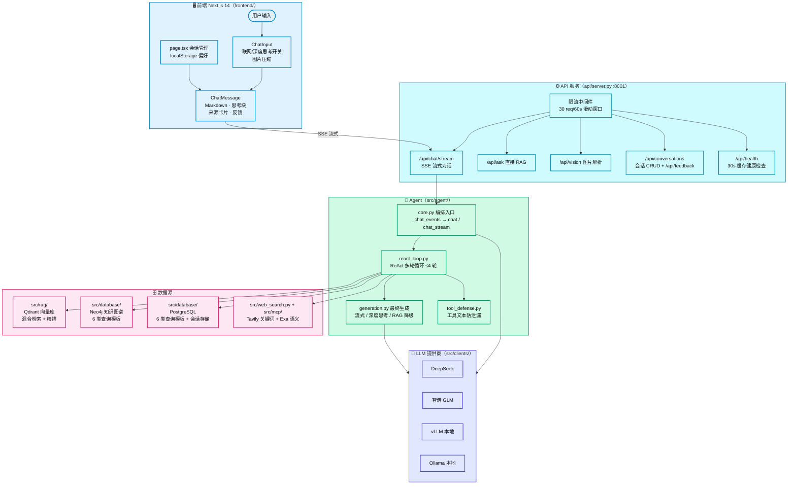
```mermaid
flowchart TB
  subgraph FE["🖥️ 前端 Next.js 14（frontend/）"]
    direction LR
    FE1(["用户输入"])
    FE2["ChatInput<br/>联网/深度思考开关<br/>图片压缩"]
    FE3["ChatMessage<br/>Markdown · 思考块<br/>来源卡片 · 反馈"]
    FE4["page.tsx 会话管理<br/>localStorage 偏好"]
    FE1 --> FE2 --> FE3
    FE4 --> FE3
  end
  subgraph API["⚙️ API 服务（api/server.py :8001）"]
    direction TB
    API1["限流中间件<br/>30 req/60s 滑动窗口"]
    API2["/api/chat/stream<br/>SSE 流式对话"]
    API3["/api/ask 直接 RAG"]
    API4["/api/vision 图片解析"]
    API5["/api/conversations<br/>会话 CRUD + /api/feedback"]
    API6["/api/health<br/>30s 缓存健康检查"]
    API1 --> API2 & API3 & API4 & API5 & API6
  end
  subgraph AG["🤖 Agent（src/agent/）"]
    direction TB
    AG1["core.py 编排入口<br/>_chat_events → chat / chat_stream"]
    AG2["react_loop.py<br/>ReAct 多轮循环 ≤4 轮"]
    AG3["generation.py 最终生成<br/>流式 / 深度思考 / RAG 降级"]
    AG4["tool_defense.py<br/>工具文本防泄漏"]
    AG1 --> AG2 --> AG3
    AG2 --> AG4
  end
  subgraph SRC["🗄️ 数据源"]
    direction LR
    S1["src/rag/<br/>Qdrant 向量库<br/>混合检索 + 精排"]
    S2["src/database/<br/>Neo4j 知识图谱<br/>6 类查询模板"]
    S3["src/database/<br/>PostgreSQL<br/>6 类查询模板 + 会话存储"]
    S4["src/web_search.py + src/mcp/<br/>Tavily 关键词 + Exa 语义"]
  end
  subgraph LLM["🧠 LLM 提供商（src/clients/）"]
    direction LR
    L1["DeepSeek"]
    L2["智谱 GLM"]
    L3["vLLM 本地"]
    L4["Ollama 本地"]
  end
  FE3 -->|"SSE 流式"| API2
  API2 --> AG1
  AG2 --> S1 & S2 & S3 & S4
  AG1 --> LLM
  AG3 --> LLM

  classDef cFE fill:#e0f2fe,stroke:#0284c7,stroke-width:2px,color:#0b0b0b;
  classDef cAPI fill:#cffafe,stroke:#0891b2,stroke-width:2px,color:#0b0b0b;
  classDef cAG fill:#d1fae5,stroke:#059669,stroke-width:2px,color:#0b0b0b;
  classDef cSRC fill:#fce7f3,stroke:#db2777,stroke-width:2px,color:#0b0b0b;
  classDef cLLM fill:#e0e7ff,stroke:#4f46e5,stroke-width:2px,color:#0b0b0b;
  class FE1,FE2,FE3,FE4 cFE;
  class API1,API2,API3,API4,API5,API6 cAPI;
  class AG1,AG2,AG3,AG4 cAG;
  class S1,S2,S3,S4 cSRC;
  class L1,L2,L3,L4 cLLM;
  style FE fill:#e0f2fe,stroke:#0284c7,stroke-width:1.5px;
  style API fill:#cffafe,stroke:#0891b2,stroke-width:1.5px;
  style AG fill:#d1fae5,stroke:#059669,stroke-width:1.5px;
  style SRC fill:#fce7f3,stroke:#db2777,stroke-width:1.5px;
  style LLM fill:#e0e7ff,stroke:#4f46e5,stroke-width:1.5px;
```

---

## 2. API 服务与请求生命周期（api/server.py）

启动时 lifespan 初始化 RAG 流水线与 Agent（含嵌入/精排模型预热、Neo4j/PostgreSQL/Tavily/Exa 客户端连接）；端点均为同步 `def`（FastAPI 自动放线程池，慢请求不阻塞事件循环与限流中间件）。

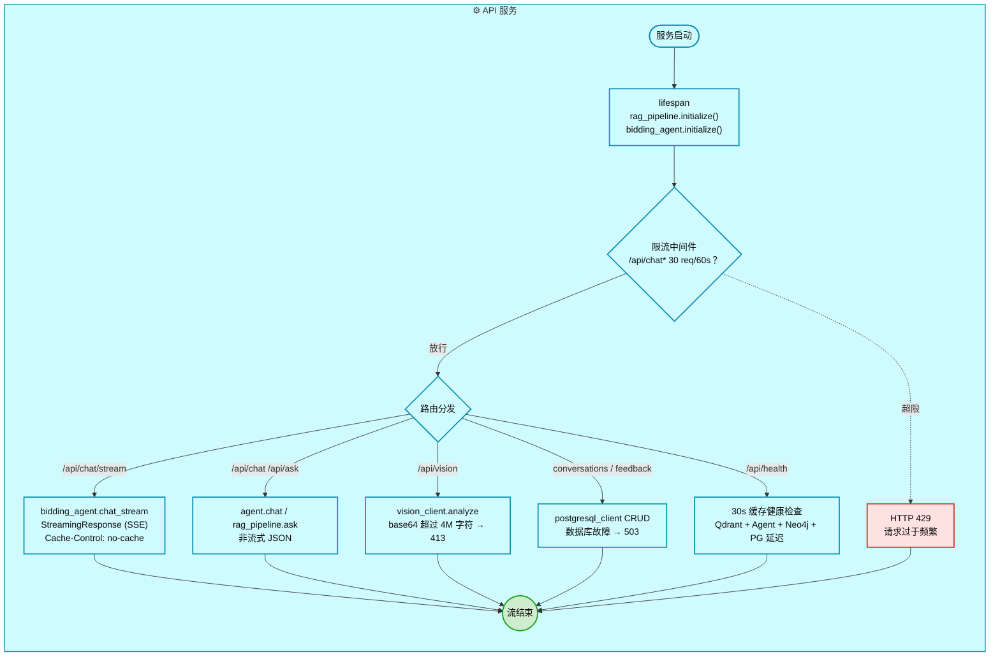
```mermaid
flowchart TB
  subgraph API["⚙️ API 服务"]
    direction TB
    A0(["服务启动"]) --> A1["lifespan<br/>rag_pipeline.initialize()<br/>bidding_agent.initialize()"]
    A1 --> A2{"限流中间件<br/>/api/chat* 30 req/60s？"}
    A2 -->|"放行"| A3{"路由分发"}
    A2 -.->|"超限"| A9["HTTP 429<br/>请求过于频繁"]
    A3 -->|"/api/chat/stream"| A4["bidding_agent.chat_stream<br/>StreamingResponse (SSE)<br/>Cache-Control: no-cache"]
    A3 -->|"/api/chat /api/ask"| A5["agent.chat / rag_pipeline.ask<br/>非流式 JSON"]
    A3 -->|"/api/vision"| A6["vision_client.analyze<br/>base64 超过 4M 字符 → 413"]
    A3 -->|"conversations / feedback"| A7["postgresql_client CRUD<br/>数据库故障 → 503"]
    A3 -->|"/api/health"| A8["30s 缓存健康检查<br/>Qdrant + Agent + Neo4j + PG 延迟"]
    A4 --> E1(("流结束"))
    A5 --> E1
    A6 --> E1
    A7 --> E1
    A8 --> E1
    A9 --> E1
  end

  classDef cAPI fill:#cffafe,stroke:#0891b2,stroke-width:2px,color:#0b0b0b;
  classDef cOK fill:#cfeccf,stroke:#0ca30c,stroke-width:2px,color:#0b0b0b;
  classDef cERR fill:#fee2e2,stroke:#dc2626,stroke-width:2px,color:#0b0b0b;
  class A0,A1,A2,A3,A4,A5,A6,A7,A8 cAPI;
  class E1 cOK;
  class A9 cERR;
  style API fill:#cffafe,stroke:#0891b2,stroke-width:1.5px;
```

---

## 3. 数据导入（src/rag/ingest.py）

Excel Q&A → 列名标准化/去空去重 → BM25 词汇表构建 → 双向量编码 → 批量写入 Qdrant → 词汇表落盘；`python main.py ingest` 全量重建（`force=True` 先删集合）。

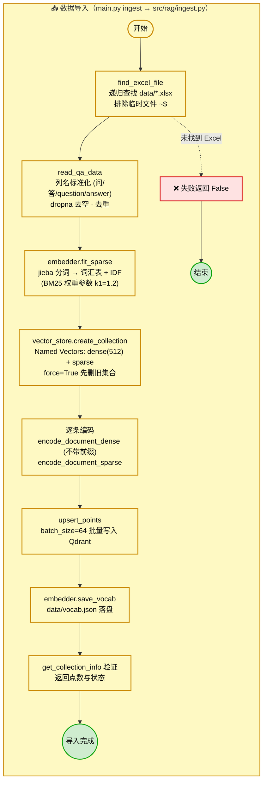
```mermaid
flowchart TB
  subgraph INGEST["📥 数据导入（main.py ingest → src/rag/ingest.py）"]
    direction TB
    I0(["开始"]) --> I1["find_excel_file<br/>递归查找 data/*.xlsx<br/>排除临时文件 ~$"]
    I1 --> I2["read_qa_data<br/>列名标准化 (问/答/question/answer)<br/>dropna 去空 · 去重"]
    I2 --> I3["embedder.fit_sparse<br/>jieba 分词 → 词汇表 + IDF<br/>(BM25 权重参数 k1=1.2)"]
    I3 --> I4["vector_store.create_collection<br/>Named Vectors: dense(512) + sparse<br/>force=True 先删旧集合"]
    I4 --> I5["逐条编码<br/>encode_document_dense (不带前缀)<br/>encode_document_sparse"]
    I5 --> I6["upsert_points<br/>batch_size=64 批量写入 Qdrant"]
    I6 --> I7["embedder.save_vocab<br/>data/vocab.json 落盘"]
    I7 --> I8["get_collection_info 验证<br/>返回点数与状态"]
    I8 --> I9(("导入完成"))
    I1 -.->|"未找到 Excel"| IE["❌ 失败返回 False"]
    IE --> IE9(("结束"))
  end

  classDef cIN fill:#fef9c3,stroke:#ca8a04,stroke-width:2px,color:#0b0b0b;
  classDef cOK fill:#cfeccf,stroke:#0ca30c,stroke-width:2px,color:#0b0b0b;
  classDef cERR fill:#fee2e2,stroke:#dc2626,stroke-width:2px,color:#0b0b0b;
  class I0,I1,I2,I3,I4,I5,I6,I7,I8 cIN;
  class I9,IE9 cOK;
  class IE cERR;
  style INGEST fill:#fef9c3,stroke:#ca8a04,stroke-width:1.5px;
```

---

## 4. 混合检索流水线（src/rag/）

查询先按词表分类（keyword / concept / mixed），映射不同 RRF k 值；Qdrant `Prefetch + RrfQuery` 原生融合 dense 与 sparse 双路结果，召回 30 条后经 CrossEncoder 精排取 top-k，结果带 128 条 LRU 缓存。

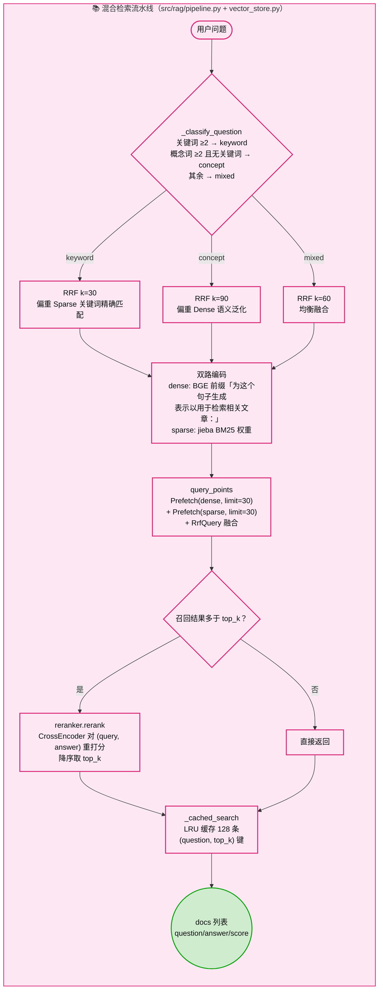
```mermaid
flowchart TB
  subgraph RAG["📚 混合检索流水线（src/rag/pipeline.py + vector_store.py）"]
    direction TB
    R0(["用户问题"]) --> R1{"_classify_question<br/>关键词 ≥2 → keyword<br/>概念词 ≥2 且无关键词 → concept<br/>其余 → mixed"}
    R1 -->|"keyword"| R2["RRF k=30<br/>偏重 Sparse 关键词精确匹配"]
    R1 -->|"concept"| R3["RRF k=90<br/>偏重 Dense 语义泛化"]
    R1 -->|"mixed"| R4["RRF k=60<br/>均衡融合"]
    R2 & R3 & R4 --> R5["双路编码<br/>dense: BGE 前缀「为这个句子生成<br/>表示以用于检索相关文章：」<br/>sparse: jieba BM25 权重"]
    R5 --> R6["query_points<br/>Prefetch(dense, limit=30)<br/>+ Prefetch(sparse, limit=30)<br/>+ RrfQuery 融合"]
    R6 --> R7{"召回结果多于 top_k？"}
    R7 -->|"是"| R8["reranker.rerank<br/>CrossEncoder 对 (query, answer) 重打分<br/>降序取 top_k"]
    R7 -->|"否"| R9["直接返回"]
    R8 --> R10["_cached_search<br/>LRU 缓存 128 条<br/>(question, top_k) 键"]
    R9 --> R10
    R10 --> R11(("docs 列表<br/>question/answer/score"))
  end

  classDef cRAG fill:#fce7f3,stroke:#db2777,stroke-width:2px,color:#0b0b0b;
  classDef cOK fill:#cfeccf,stroke:#0ca30c,stroke-width:2px,color:#0b0b0b;
  class R0,R1,R2,R3,R4,R5,R6,R7,R8,R9,R10 cRAG;
  class R11 cOK;
  style RAG fill:#fce7f3,stroke:#db2777,stroke-width:1.5px;
```

---

## 5. 嵌入与精排模型（src/rag/embedder.py）

三个模型组件全部懒加载 + 双重检查锁（并发首用只加载一份，防止双份模型挤爆 30s 工具超时）；GPU 显存不足时自动降级 CPU。

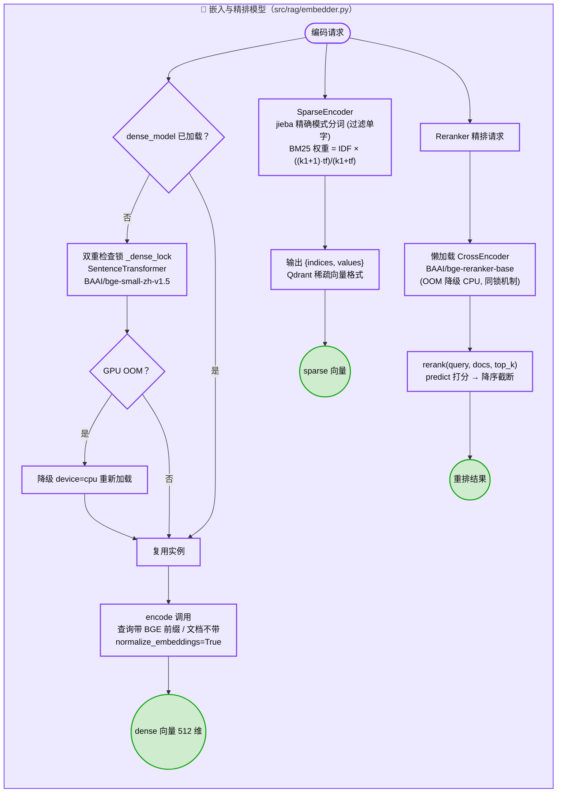
```mermaid
flowchart TB
  subgraph EMB["🧬 嵌入与精排模型（src/rag/embedder.py）"]
    direction TB
    E0(["编码请求"]) --> E1{"dense_model 已加载？"}
    E1 -->|"否"| E2["双重检查锁 _dense_lock<br/>SentenceTransformer<br/>BAAI/bge-small-zh-v1.5"]
    E2 --> E3{"GPU OOM？"}
    E3 -->|"是"| E4["降级 device=cpu 重新加载"]
    E1 -->|"是"| E5["复用实例"]
    E3 -->|"否"| E5
    E4 --> E5
    E5 --> E6["encode 调用<br/>查询带 BGE 前缀 / 文档不带<br/>normalize_embeddings=True"]
    E0 --> E7["SparseEncoder<br/>jieba 精确模式分词 (过滤单字)<br/>BM25 权重 = IDF × ((k1+1)·tf)/(k1+tf)"]
    E7 --> E8["输出 {indices, values}<br/>Qdrant 稀疏向量格式"]
    E0 --> E9["Reranker 精排请求"]
    E9 --> E10["懒加载 CrossEncoder<br/>BAAI/bge-reranker-base<br/>(OOM 降级 CPU, 同锁机制)"]
    E10 --> E11["rerank(query, docs, top_k)<br/>predict 打分 → 降序截断"]
    E6 --> E12(("dense 向量 512 维"))
    E8 --> E13(("sparse 向量"))
    E11 --> E14(("重排结果"))
  end

  classDef cEMB fill:#ede9fe,stroke:#7c3aed,stroke-width:2px,color:#0b0b0b;
  classDef cOK fill:#cfeccf,stroke:#0ca30c,stroke-width:2px,color:#0b0b0b;
  class E0,E1,E2,E3,E4,E5,E6,E7,E8,E9,E10,E11 cEMB;
  class E12,E13,E14 cOK;
  style EMB fill:#ede9fe,stroke:#7c3aed,stroke-width:1.5px;
```

---

## 6. Agent 核心编排（src/agent/core.py）

`_chat_events` 是唯一编排入口（流式/非流式共用同一事件流）：就绪校验 → 请求级 LLM 客户端解析 → Ollama 特判走纯 RAG 降级 → 进入 ReAct 工具循环；最外层兜底保证前端永远收到完整事件流。

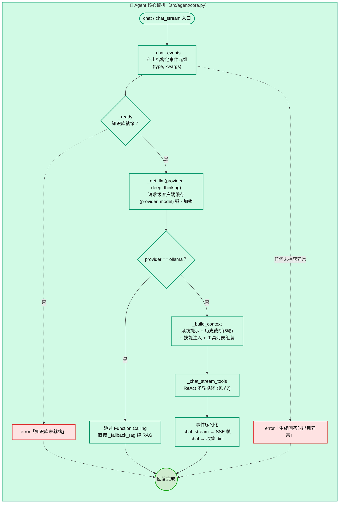
```mermaid
flowchart TB
  subgraph CORE["🎯 Agent 核心编排（src/agent/core.py）"]
    direction TB
    C0(["chat / chat_stream 入口"]) --> C1["_chat_events<br/>产出结构化事件元组<br/>(type, kwargs)"]
    C1 --> C2{"_ready<br/>知识库就绪？"}
    C2 -.->|"否"| CE1["error「知识库未就绪」"]
    C2 -->|"是"| C3["_get_llm(provider, deep_thinking)<br/>请求级客户端缓存<br/>(provider, model) 键 · 加锁"]
    C3 --> C4{"provider == ollama？"}
    C4 -->|"是"| C5["跳过 Function Calling<br/>直接 _fallback_rag 纯 RAG"]
    C4 -->|"否"| C6["_build_context<br/>系统提示 + 历史截断(5轮)<br/>+ 技能注入 + 工具列表组装"]
    C6 --> C7["_chat_stream_tools<br/>ReAct 多轮循环 (见 §7)"]
    C7 --> C8["事件序列化<br/>chat_stream → SSE 帧<br/>chat → 收集 dict"]
    C8 --> C9(("回答完成"))
    CE1 -.-> C9
    C5 -.-> C9
    C1 -.->|"任何未捕获异常"| CE2["error「生成回答时出现异常」"]
    CE2 -.-> C9
  end

  classDef cCORE fill:#d1fae5,stroke:#059669,stroke-width:2px,color:#0b0b0b;
  classDef cOK fill:#cfeccf,stroke:#0ca30c,stroke-width:2px,color:#0b0b0b;
  classDef cERR fill:#fee2e2,stroke:#dc2626,stroke-width:2px,color:#0b0b0b;
  class C0,C1,C2,C3,C4,C5,C6,C7,C8 cCORE;
  class C9 cOK;
  class CE1,CE2 cERR;
  style CORE fill:#d1fae5,stroke:#059669,stroke-width:1.5px;
```

---

## 7. ReAct 多轮工具循环（src/agent/react_loop.py）

每轮 LLM 带工具列表调用（观察轮），基于检索结果决定补查或回答；干净直答任意轮直接流式输出，4 轮全是工具轮则注入上限约束强制生成；来源跨轮累积去重（question+answer 复合键）。

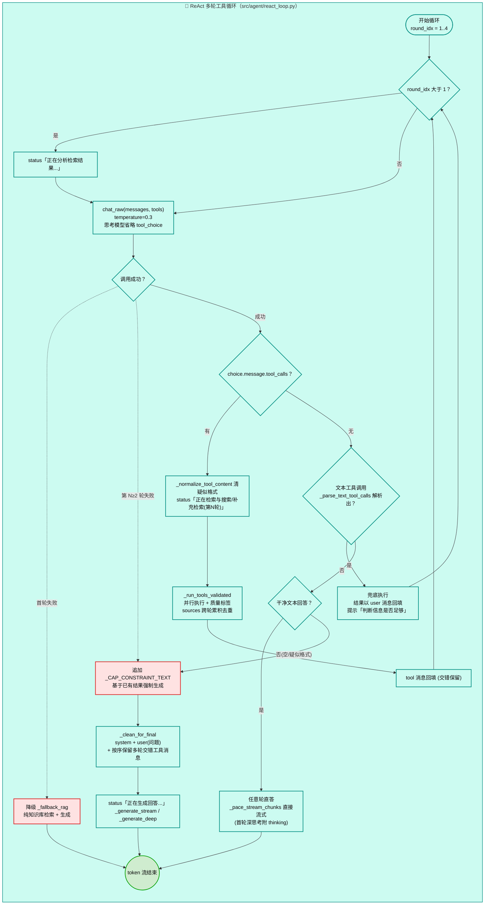
```mermaid
flowchart TB
  subgraph REACT["🔁 ReAct 多轮工具循环（src/agent/react_loop.py）"]
    direction TB
    R0(["开始循环<br/>round_idx = 1..4"]) --> R1{"round_idx 大于 1？"}
    R1 -->|"是"| R2["status「正在分析检索结果...」"]
    R1 -->|"否"| R3["chat_raw(messages, tools)<br/>temperature=0.3<br/>思考模型省略 tool_choice"]
    R2 --> R3
    R3 --> R4{"调用成功？"}
    R4 -.->|"首轮失败"| RF["降级 _fallback_rag<br/>纯知识库检索 + 生成"]
    R4 -.->|"第 N≥2 轮失败"| RC["追加 _CAP_CONSTRAINT_TEXT<br/>基于已有结果强制生成"]
    R4 -->|"成功"| R5{"choice.message.tool_calls？"}
    R5 -->|"有"| R6["_normalize_tool_content 清疑似格式<br/>status「正在检索与搜索/补充检索(第N轮)」"]
    R6 --> R7["_run_tools_validated<br/>并行执行 + 质量标签<br/>sources 跨轮累积去重"]
    R7 --> R8["tool 消息回填 (交错保留)"]
    R8 --> R1
    R5 -->|"无"| R9{"文本工具调用<br/>_parse_text_tool_calls 解析出？"}
    R9 -->|"是"| R10["兜底执行<br/>结果以 user 消息回填<br/>提示「判断信息是否足够」"]
    R10 --> R1
    R9 -->|"否"| R11{"干净文本回答？"}
    R11 -->|"是"| R12["任意轮直答<br/>_pace_stream_chunks 直接流式<br/>(首轮深思考附 thinking)"]
    R11 -->|"否(空/疑似格式)"| RC
    R12 --> R15(("token 流结束"))
    RF --> R15
    RC --> R13["_clean_for_final<br/>system + user(问题)<br/>+ 按序保留多轮交错工具消息"]
    R13 --> R14["status「正在生成回答...」<br/>_generate_stream / _generate_deep"]
    R14 --> R15
  end

  classDef cRCT fill:#ccfbf1,stroke:#0d9488,stroke-width:2px,color:#0b0b0b;
  classDef cOK fill:#cfeccf,stroke:#0ca30c,stroke-width:2px,color:#0b0b0b;
  classDef cERR fill:#fee2e2,stroke:#dc2626,stroke-width:2px,color:#0b0b0b;
  class R0,R1,R2,R3,R4,R5,R6,R7,R8,R9,R10,R11,R12,R13,R14 cRCT;
  class R15 cOK;
  class RF,RC cERR;
  style REACT fill:#ccfbf1,stroke:#0d9488,stroke-width:1.5px;
```

---

## 8. 工具调用防泄漏（src/agent/tool_defense.py）

部分模型把函数调用以 `<tool_call>` / JSON / DSML 文本塞进正文而非 `tool_calls` 字段——三道防线：全文本多格式检测、回合 content 归一化清空、文本工具调用解析后真实执行。

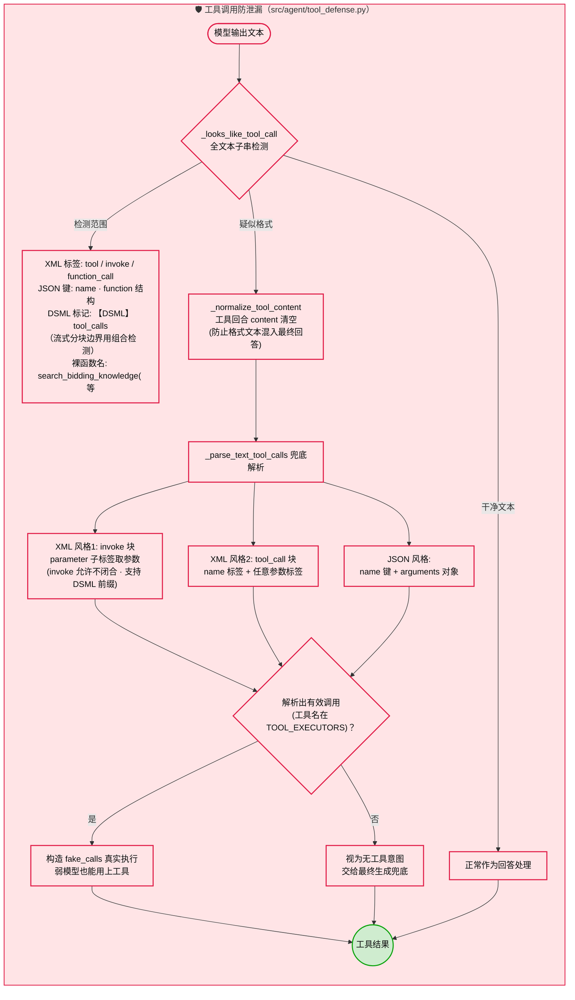
```mermaid
flowchart TB
  subgraph DEF["🛡️ 工具调用防泄漏（src/agent/tool_defense.py）"]
    direction TB
    D0(["模型输出文本"]) --> D1{"_looks_like_tool_call<br/>全文本子串检测"}
    D1 -->|"检测范围"| D2["XML 标签: tool / invoke / function_call<br/>JSON 键: name · function 结构<br/>DSML 标记: 【DSML】tool_calls<br/>（流式分块边界用组合检测）<br/>裸函数名: search_bidding_knowledge( 等"]
    D1 -->|"疑似格式"| D3["_normalize_tool_content<br/>工具回合 content 清空<br/>(防止格式文本混入最终回答)"]
    D3 --> D4["_parse_text_tool_calls 兜底解析"]
    D4 --> D5["XML 风格1: invoke 块<br/>parameter 子标签取参数<br/>(invoke 允许不闭合 · 支持 DSML 前缀)"]
    D4 --> D6["XML 风格2: tool_call 块<br/>name 标签 + 任意参数标签"]
    D4 --> D7["JSON 风格:<br/>name 键 + arguments 对象"]
    D5 & D6 & D7 --> D8{"解析出有效调用<br/>(工具名在 TOOL_EXECUTORS)？"}
    D8 -->|"是"| D9["构造 fake_calls 真实执行<br/>弱模型也能用上工具"]
    D8 -->|"否"| D10["视为无工具意图<br/>交给最终生成兜底"]
    D1 -->|"干净文本"| D11["正常作为回答处理"]
    D9 --> E(("工具结果"))
    D10 --> E
    D11 --> E
  end

  classDef cDEF fill:#ffe4e6,stroke:#e11d48,stroke-width:2px,color:#0b0b0b;
  classDef cOK fill:#cfeccf,stroke:#0ca30c,stroke-width:2px,color:#0b0b0b;
  class D0,D1,D2,D3,D4,D5,D6,D7,D8,D9,D10,D11 cDEF;
  class E cOK;
  style DEF fill:#ffe4e6,stroke:#e11d48,stroke-width:1.5px;
```

---

## 9. 最终回答生成（src/agent/generation.py）

四条生成路径共用防泄漏缓冲：正文增量先入 80 字符小缓冲，确认无工具调用格式才按 40 字符小帧 + 20ms 延时逐段流式；检出格式则发 `reset` 清空前端已流内容并追加约束重试。

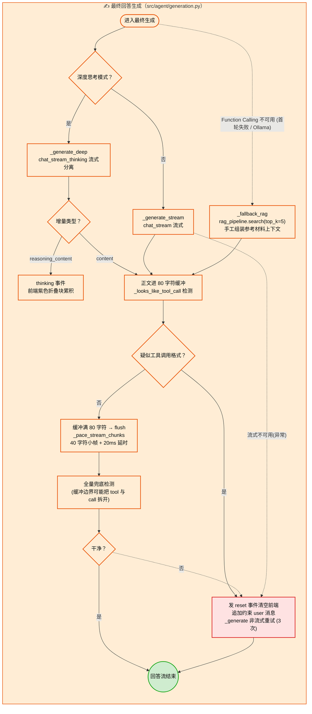
```mermaid
flowchart TB
  subgraph GEN["✍️ 最终回答生成（src/agent/generation.py）"]
    direction TB
    G0(["进入最终生成"]) --> G1{"深度思考模式？"}
    G1 -->|"是"| G2["_generate_deep<br/>chat_stream_thinking 流式分离"]
    G2 --> G3{"增量类型？"}
    G3 -->|"reasoning_content"| G4["thinking 事件<br/>前端紫色折叠块累积"]
    G3 -->|"content"| G5["正文进 80 字符缓冲<br/>_looks_like_tool_call 检测"]
    G1 -->|"否"| G6["_generate_stream<br/>chat_stream 流式"]
    G6 --> G5
    G5 --> G7{"疑似工具调用格式？"}
    G7 -->|"是"| G8["发 reset 事件清空前端<br/>追加约束 user 消息<br/>_generate 非流式重试 (3 次)"]
    G7 -->|"否"| G9["缓冲满 80 字符 → flush<br/>_pace_stream_chunks<br/>40 字符小帧 + 20ms 延时"]
    G9 --> G10["全量兜底检测<br/>(缓冲边界可能把 tool 与 call 拆开)"]
    G10 --> G11{"干净？"}
    G11 -->|"是"| G12(("回答流结束"))
    G11 -.->|"否"| G8
    G8 --> G12
    G6 -.->|"流式不可用(异常)"| G8
    G0 -.->|"Function Calling 不可用 (首轮失败 / Ollama)"| GF["_fallback_rag<br/>rag_pipeline.search(top_k=5)<br/>手工组装参考材料上下文"]
    GF --> G5
  end

  classDef cGEN fill:#ffedd5,stroke:#ea580c,stroke-width:2px,color:#0b0b0b;
  classDef cOK fill:#cfeccf,stroke:#0ca30c,stroke-width:2px,color:#0b0b0b;
  classDef cERR fill:#fee2e2,stroke:#dc2626,stroke-width:2px,color:#0b0b0b;
  class G0,G1,G2,G3,G4,G5,G6,G7,G9,G10,G11,GF cGEN;
  class G12 cOK;
  class G8 cERR;
  style GEN fill:#ffedd5,stroke:#ea580c,stroke-width:1.5px;
```

---

## 10. LLM 客户端工厂（src/clients/）

统一接口 `BaseLLMClient`：`chat` / `chat_stream` / `chat_stream_thinking`（思考与正文分离流式）/ `chat_raw`（Agent 需要 tool_calls 时用）；推理模型正文为空时回退 `reasoning_content`。

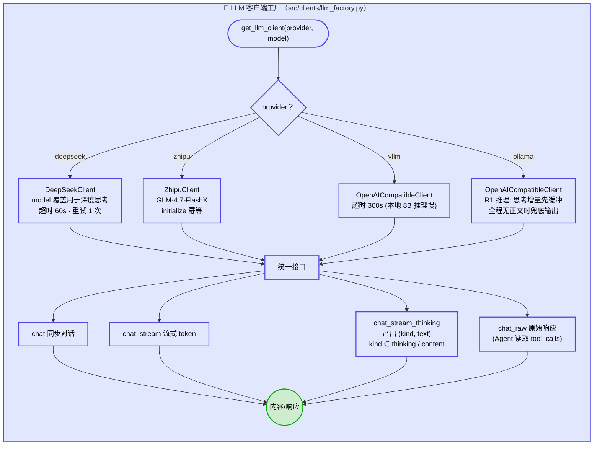
```mermaid
flowchart TB
  subgraph CL["🧠 LLM 客户端工厂（src/clients/llm_factory.py）"]
    direction TB
    CL0(["get_llm_client(provider, model)"]) --> CL1{"provider？"}
    CL1 -->|"deepseek"| CL2["DeepSeekClient<br/>model 覆盖用于深度思考<br/>超时 60s · 重试 1 次"]
    CL1 -->|"zhipu"| CL3["ZhipuClient<br/>GLM-4.7-FlashX<br/>initialize 幂等"]
    CL1 -->|"vllm"| CL4["OpenAICompatibleClient<br/>超时 300s (本地 8B 推理慢)"]
    CL1 -->|"ollama"| CL5["OpenAICompatibleClient<br/>R1 推理: 思考增量先缓冲<br/>全程无正文时兜底输出"]
    CL2 & CL3 & CL4 & CL5 --> CL6["统一接口"]
    CL6 --> CL7["chat 同步对话"]
    CL6 --> CL8["chat_stream 流式 token"]
    CL6 --> CL9["chat_stream_thinking<br/>产出 (kind, text)<br/>kind ∈ thinking / content"]
    CL6 --> CL10["chat_raw 原始响应<br/>(Agent 读取 tool_calls)"]
    CL7 & CL8 & CL9 & CL10 --> CL11(("内容/响应"))
  end

  classDef cCL fill:#e0e7ff,stroke:#4f46e5,stroke-width:2px,color:#0b0b0b;
  classDef cOK fill:#cfeccf,stroke:#0ca30c,stroke-width:2px,color:#0b0b0b;
  class CL0,CL1,CL2,CL3,CL4,CL5,CL6,CL7,CL8,CL9,CL10 cCL;
  class CL11 cOK;
  style CL fill:#e0e7ff,stroke:#4f46e5,stroke-width:1.5px;
```

---

## 11. 深度思考机制（推理模型优先 + 提示词回退）

开启后：配置了思考模型则切换独立客户端（构造期 model 覆盖，省略 `tool_choice` 规避 DeepSeek 推理模型 400，输出预算放大到 8192）；未配置则提示词注入 + `_fallback_rag` 同步注入（本地模型路径）。

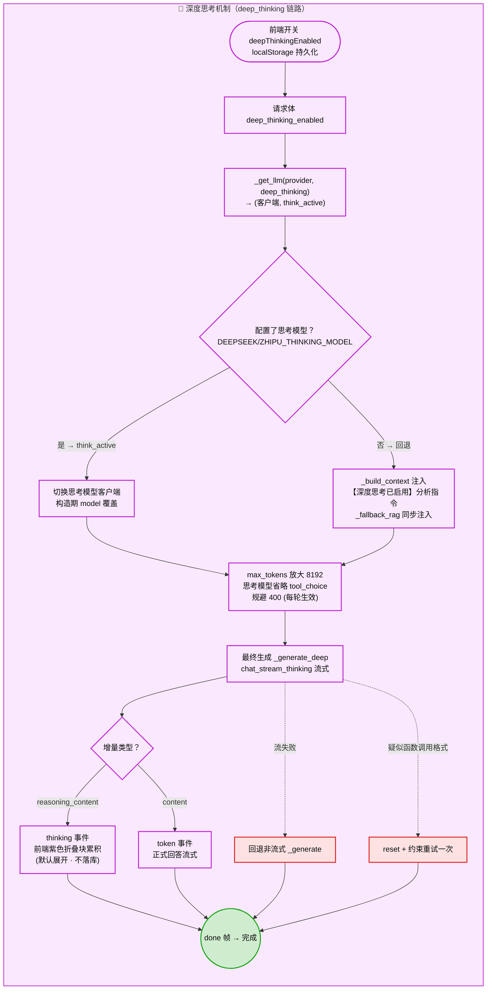
```mermaid
flowchart TB
  subgraph DEEP["🧠 深度思考机制（deep_thinking 链路）"]
    direction TB
    DT0(["前端开关 deepThinkingEnabled<br/>localStorage 持久化"]) --> DT1["请求体 deep_thinking_enabled"]
    DT1 --> DT2["_get_llm(provider, deep_thinking)<br/>→ (客户端, think_active)"]
    DT2 --> DT3{"配置了思考模型？<br/>DEEPSEEK/ZHIPU_THINKING_MODEL"}
    DT3 -->|"是 → think_active"| DT4["切换思考模型客户端<br/>构造期 model 覆盖"]
    DT3 -->|"否 → 回退"| DT5["_build_context 注入<br/>【深度思考已启用】分析指令<br/>_fallback_rag 同步注入"]
    DT4 --> DT6["max_tokens 放大 8192<br/>思考模型省略 tool_choice<br/>规避 400 (每轮生效)"]
    DT5 --> DT6
    DT6 --> DT7["最终生成 _generate_deep<br/>chat_stream_thinking 流式"]
    DT7 --> DT8{"增量类型？"}
    DT8 -->|"reasoning_content"| DT9["thinking 事件<br/>前端紫色折叠块累积<br/>(默认展开 · 不落库)"]
    DT8 -->|"content"| DT10["token 事件<br/>正式回答流式"]
    DT7 -.->|"流失败"| DT11["回退非流式 _generate"]
    DT7 -.->|"疑似函数调用格式"| DT12["reset + 约束重试一次"]
    DT9 --> DT13(("done 帧 → 完成"))
    DT10 --> DT13
    DT11 --> DT13
    DT12 --> DT13
  end

  classDef cDP fill:#fae8ff,stroke:#c026d3,stroke-width:2px,color:#0b0b0b;
  classDef cOK fill:#cfeccf,stroke:#0ca30c,stroke-width:2px,color:#0b0b0b;
  classDef cERR fill:#fee2e2,stroke:#dc2626,stroke-width:2px,color:#0b0b0b;
  class DT0,DT1,DT2,DT3,DT4,DT5,DT6,DT7,DT8,DT9,DT10 cDP;
  class DT13 cOK;
  class DT11,DT12 cERR;
  style DEEP fill:#fae8ff,stroke:#c026d3,stroke-width:1.5px;
```

---

## 12. 技能机制（src/agent/skills.py）

技能是**上下文注入而非工具调用**：扫描 `src/skills/*/SKILL.md` 的 frontmatter 建注册表，三层匹配（点名 name / 命中中文别名 / 指代词回看历史），命中后技能正文注入系统提示，同一轮工具调用即遵循其流程。

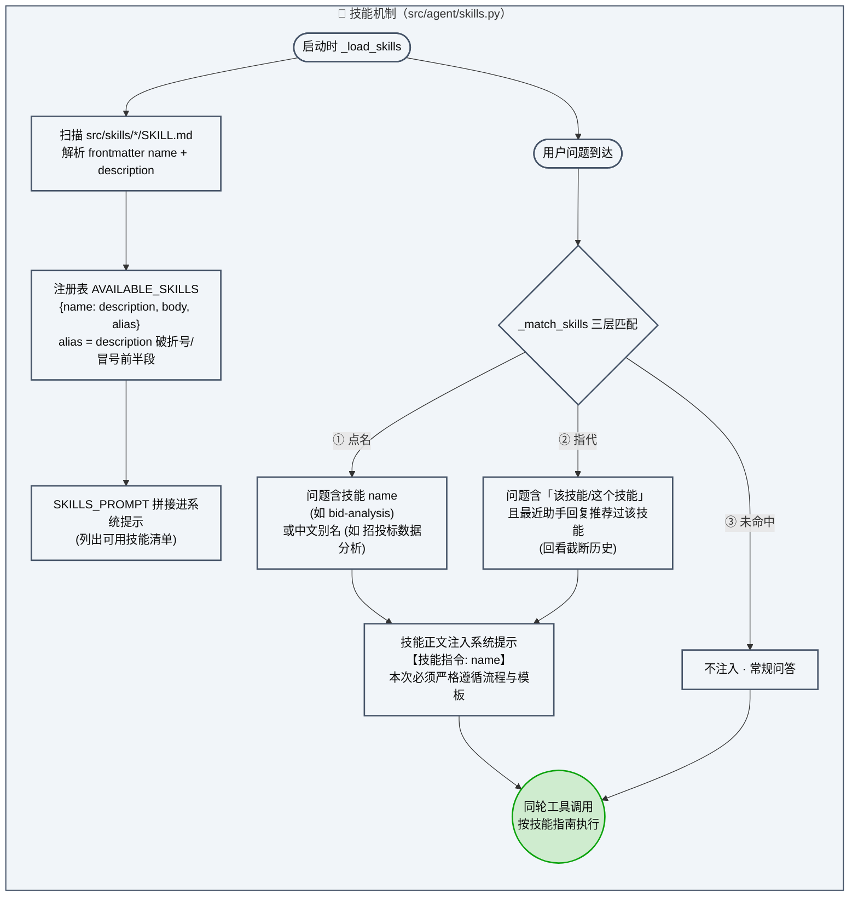
```mermaid
flowchart TB
  subgraph SK["📜 技能机制（src/agent/skills.py）"]
    direction TB
    SK0(["启动时 _load_skills"]) --> SK1["扫描 src/skills/*/SKILL.md<br/>解析 frontmatter name + description"]
    SK1 --> SK2["注册表 AVAILABLE_SKILLS<br/>{name: description, body, alias}<br/>alias = description 破折号/冒号前半段"]
    SK2 --> SK3["SKILLS_PROMPT 拼接进系统提示<br/>(列出可用技能清单)"]
    SK0 --> SK4(["用户问题到达"]) 
    SK4 --> SK5{"_match_skills 三层匹配"}
    SK5 -->|"① 点名"| SK6["问题含技能 name<br/>(如 bid-analysis)<br/>或中文别名 (如 招投标数据分析)"]
    SK5 -->|"② 指代"| SK7["问题含「该技能/这个技能」<br/>且最近助手回复推荐过该技能<br/>(回看截断历史)"]
    SK5 -->|"③ 未命中"| SK8["不注入 · 常规问答"]
    SK6 & SK7 --> SK9["技能正文注入系统提示<br/>【技能指令: name】<br/>本次必须严格遵循流程与模板"]
    SK9 --> SK10(("同轮工具调用<br/>按技能指南执行"))
    SK8 --> SK10
  end

  classDef cSK fill:#f1f5f9,stroke:#475569,stroke-width:2px,color:#0b0b0b;
  classDef cOK fill:#cfeccf,stroke:#0ca30c,stroke-width:2px,color:#0b0b0b;
  class SK0,SK1,SK2,SK3,SK4,SK5,SK6,SK7,SK8,SK9 cSK;
  class SK10 cOK;
  style SK fill:#f1f5f9,stroke:#475569,stroke-width:1.5px;
```

---

## 13. 工具执行层（src/tools/）

`ToolRunner` 并行执行（4 线程 / 30s 总超时 / 单工具异常隔离）；结果经 `_validate_result` 附质量标签；四种格式化器处理各数据源；联网结果再经 CrossEncoder 与用户问题重排（归一化 0-1）。

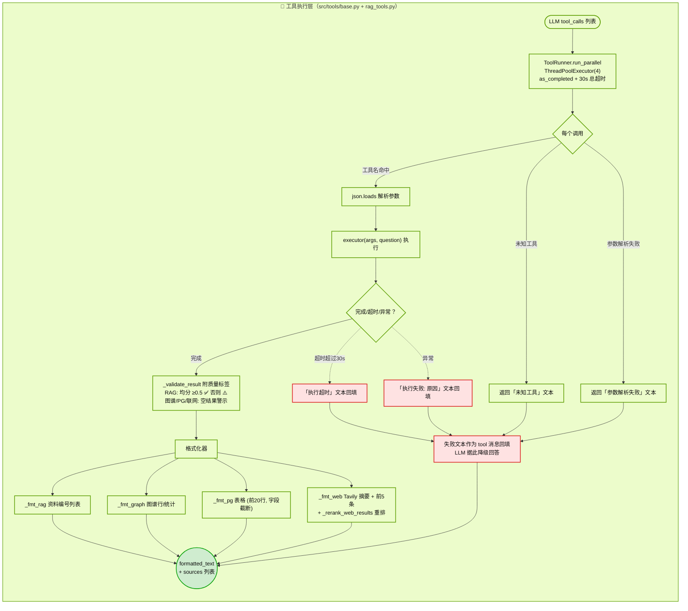
```mermaid
flowchart TB
  subgraph TOOL["🔧 工具执行层（src/tools/base.py + rag_tools.py）"]
    direction TB
    T0(["LLM tool_calls 列表"]) --> T1["ToolRunner.run_parallel<br/>ThreadPoolExecutor(4)<br/>as_completed + 30s 总超时"]
    T1 --> T2{"每个调用"}
    T2 -->|"工具名命中"| T3["json.loads 解析参数"]
    T2 -->|"未知工具"| T4["返回「未知工具」文本"]
    T2 -->|"参数解析失败"| T5["返回「参数解析失败」文本"]
    T3 --> T6["executor(args, question) 执行"]
    T6 --> T7{"完成/超时/异常？"}
    T7 -->|"完成"| T8["_validate_result 附质量标签<br/>RAG: 均分 ≥0.5 ✅ 否则 ⚠️<br/>图谱/PG/联网: 空结果警示"]
    T7 -.->|"超时超过30s"| T9["「执行超时」文本回填"]
    T7 -.->|"异常"| T10["「执行失败: 原因」文本回填"]
    T4 & T5 & T9 & T10 --> T11["失败文本作为 tool 消息回填<br/>LLM 据此降级回答"]
    T8 --> T12["格式化器"]
    T12 --> T13["_fmt_rag 资料编号列表"]
    T12 --> T14["_fmt_graph 图谱行/统计"]
    T12 --> T15["_fmt_pg 表格 (前20行, 字段截断)"]
    T12 --> T16["_fmt_web Tavily 摘要 + 前5条<br/>+ _rerank_web_results 重排"]
    T13 & T14 & T15 & T16 --> T17(("formatted_text<br/>+ sources 列表"))
    T11 --> T17
  end

  classDef cTL fill:#ecfccb,stroke:#65a30d,stroke-width:2px,color:#0b0b0b;
  classDef cOK fill:#cfeccf,stroke:#0ca30c,stroke-width:2px,color:#0b0b0b;
  classDef cERR fill:#fee2e2,stroke:#dc2626,stroke-width:2px,color:#0b0b0b;
  class T0,T1,T2,T3,T4,T5,T6,T7,T8,T12,T13,T14,T15,T16 cTL;
  class T17 cOK;
  class T9,T10,T11 cERR;
  style TOOL fill:#ecfccb,stroke:#65a30d,stroke-width:1.5px;
```

---

## 14. 知识图谱查询（src/database/neo4j_client.py）

星型 schema（SubjectMatter 中心，关联采购人/供应商/代理机构/地址/交易），6 类查询模板路由，单查询 30s 服务端超时；懒初始化 + 连接失败优雅降级。

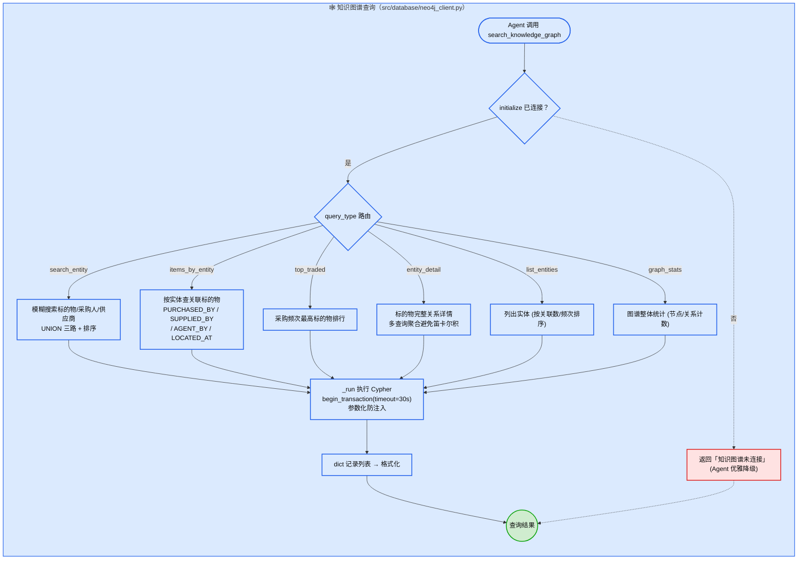
```mermaid
flowchart TB
  subgraph NEO["🕸️ 知识图谱查询（src/database/neo4j_client.py）"]
    direction TB
    N0(["Agent 调用 search_knowledge_graph"]) --> N1{"initialize 已连接？"}
    N1 -.->|"否"| N2["返回「知识图谱未连接」<br/>(Agent 优雅降级)"]
    N1 -->|"是"| N3{"query_type 路由"}
    N3 -->|"search_entity"| N4["模糊搜索标的物/采购人/供应商<br/>UNION 三路 + 排序"]
    N3 -->|"items_by_entity"| N5["按实体查关联标的物<br/>PURCHASED_BY / SUPPLIED_BY<br/>/ AGENT_BY / LOCATED_AT"]
    N3 -->|"top_traded"| N6["采购频次最高标的物排行"]
    N3 -->|"entity_detail"| N7["标的物完整关系详情<br/>多查询聚合避免笛卡尔积"]
    N3 -->|"list_entities"| N8["列出实体 (按关联数/频次排序)"]
    N3 -->|"graph_stats"| N9["图谱整体统计 (节点/关系计数)"]
    N4 & N5 & N6 & N7 & N8 & N9 --> N10["_run 执行 Cypher<br/>begin_transaction(timeout=30s)<br/>参数化防注入"]
    N10 --> N11["dict 记录列表 → 格式化"]
    N11 --> N12(("查询结果"))
    N2 -.-> N12
  end

  classDef cNEO fill:#dbeafe,stroke:#2563eb,stroke-width:2px,color:#0b0b0b;
  classDef cOK fill:#cfeccf,stroke:#0ca30c,stroke-width:2px,color:#0b0b0b;
  classDef cERR fill:#fee2e2,stroke:#dc2626,stroke-width:2px,color:#0b0b0b;
  class N0,N1,N3,N4,N5,N6,N7,N8,N9,N10,N11 cNEO;
  class N12 cOK;
  class N2 cERR;
  style NEO fill:#dbeafe,stroke:#2563eb,stroke-width:1.5px;
```

---

## 15. 数据库查询（src/database/postgresql_client.py）

`bidding_procurement` 表 6 类查询模板：字段白名单校验、参数化 SQL 防注入、LIKE 通配符转义、**正向+反向双向模糊匹配**（解决 LLM 关键词过长问题）；同时承载会话/反馈 JSONB 存储。

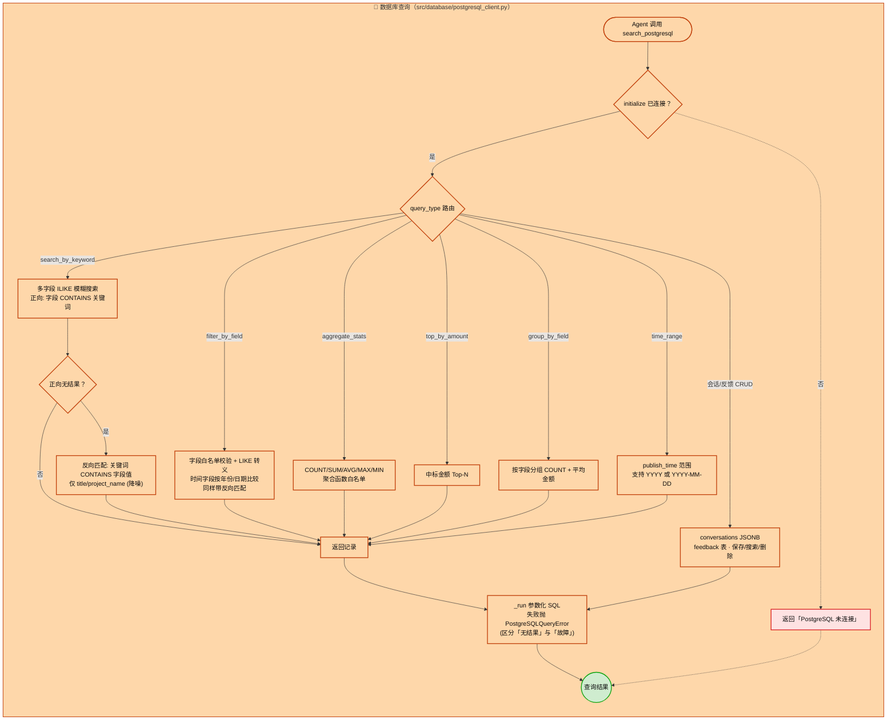
```mermaid
flowchart TB
  subgraph PG["🐘 数据库查询（src/database/postgresql_client.py）"]
    direction TB
    P0(["Agent 调用 search_postgresql"]) --> P1{"initialize 已连接？"}
    P1 -.->|"否"| P2["返回「PostgreSQL 未连接」"]
    P1 -->|"是"| P3{"query_type 路由"}
    P3 -->|"search_by_keyword"| P4["多字段 ILIKE 模糊搜索<br/>正向: 字段 CONTAINS 关键词"]
    P4 --> P5{"正向无结果？"}
    P5 -->|"是"| P6["反向匹配: 关键词 CONTAINS 字段值<br/>仅 title/project_name (降噪)"]
    P5 -->|"否"| P10
    P6 --> P10["返回记录"]
    P3 -->|"filter_by_field"| P7["字段白名单校验 + LIKE 转义<br/>时间字段按年份/日期比较<br/>同样带反向匹配"]
    P3 -->|"aggregate_stats"| P8["COUNT/SUM/AVG/MAX/MIN<br/>聚合函数白名单"]
    P3 -->|"top_by_amount"| P9["中标金额 Top-N"]
    P3 -->|"group_by_field"| P11["按字段分组 COUNT + 平均金额"]
    P3 -->|"time_range"| P12["publish_time 范围<br/>支持 YYYY 或 YYYY-MM-DD"]
    P7 & P8 & P9 & P11 & P12 --> P10
    P3 -->|"会话/反馈 CRUD"| P13["conversations JSONB<br/>feedback 表 · 保存/搜索/删除"]
    P10 --> P14["_run 参数化 SQL<br/>失败抛 PostgreSQLQueryError<br/>(区分「无结果」与「故障」)"]
    P13 --> P14
    P14 --> P15(("查询结果"))
    P2 -.-> P15
  end

  classDef cPG fill:#fed7aa,stroke:#c2410c,stroke-width:2px,color:#0b0b0b;
  classDef cOK fill:#cfeccf,stroke:#0ca30c,stroke-width:2px,color:#0b0b0b;
  classDef cERR fill:#fee2e2,stroke:#dc2626,stroke-width:2px,color:#0b0b0b;
  class P0,P1,P3,P4,P5,P6,P7,P8,P9,P10,P11,P12,P13,P14 cPG;
  class P15 cOK;
  class P2 cERR;
  style PG fill:#fed7aa,stroke:#c2410c,stroke-width:1.5px;
```

---

## 16. 联网搜索（src/web_search.py + src/mcp/）

Tavily 关键词搜索（进程内缓存 TTL 600s / 上限 512 条，`include_answer` AI 摘要）+ Exa 语义搜索（自研 stdio JSON-RPC MCP 客户端，后台 npx 启动，未就绪时仅 Tavily）；出站请求不继承系统代理（`trust_env=False`）。

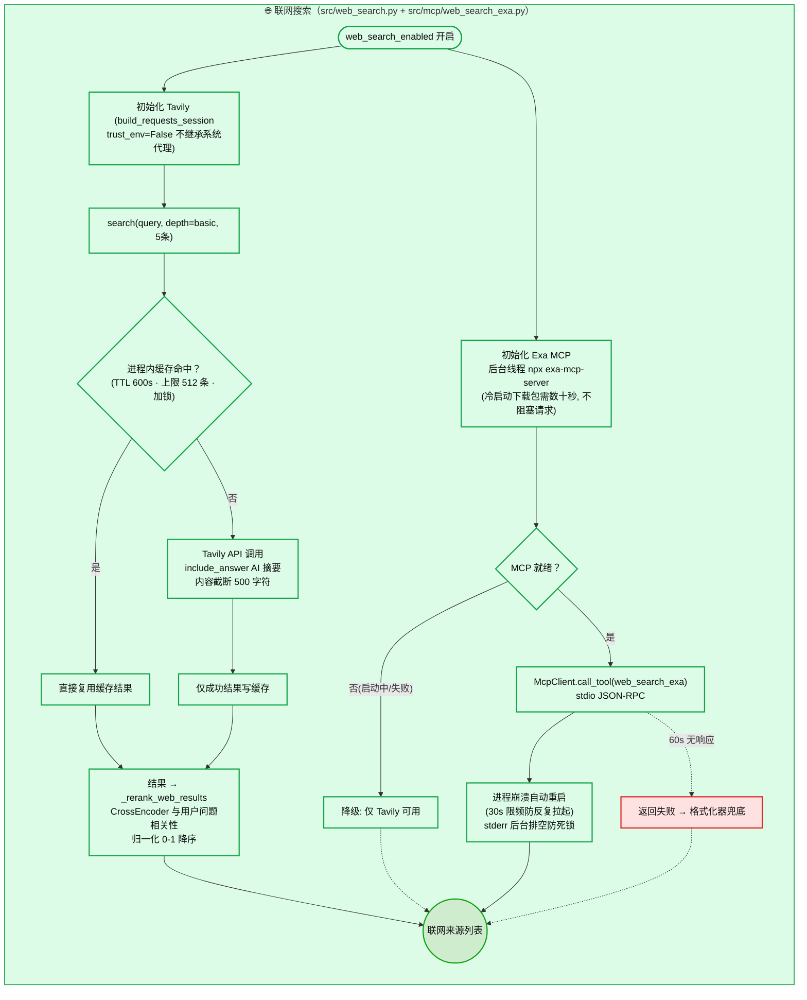
```mermaid
flowchart TB
  subgraph WEB["🌐 联网搜索（src/web_search.py + src/mcp/web_search_exa.py）"]
    direction TB
    W0(["web_search_enabled 开启"]) --> W1["初始化 Tavily (build_requests_session<br/>trust_env=False 不继承系统代理)"]
    W0 --> W2["初始化 Exa MCP<br/>后台线程 npx exa-mcp-server<br/>(冷启动下载包需数十秒, 不阻塞请求)"]
    W1 --> W3["search(query, depth=basic, 5条)"]
    W3 --> W4{"进程内缓存命中？<br/>(TTL 600s · 上限 512 条 · 加锁)"}
    W4 -->|"是"| W5["直接复用缓存结果"]
    W4 -->|"否"| W6["Tavily API 调用<br/>include_answer AI 摘要<br/>内容截断 500 字符"]
    W6 --> W7["仅成功结果写缓存"]
    W5 & W7 --> W8["结果 → _rerank_web_results<br/>CrossEncoder 与用户问题相关性<br/>归一化 0-1 降序"]
    W2 --> W9{"MCP 就绪？"}
    W9 -->|"否(启动中/失败)"| W10["降级: 仅 Tavily 可用"]
    W9 -->|"是"| W11["McpClient.call_tool(web_search_exa)<br/>stdio JSON-RPC"]
    W11 --> W12["进程崩溃自动重启<br/>(30s 限频防反复拉起)<br/>stderr 后台排空防死锁"]
    W11 -.->|"60s 无响应"| W13["返回失败 → 格式化器兜底"]
    W8 --> W14(("联网来源列表"))
    W10 -.-> W14
    W12 --> W14
    W13 -.-> W14
  end

  classDef cWB fill:#dcfce7,stroke:#16a34a,stroke-width:2px,color:#0b0b0b;
  classDef cOK fill:#cfeccf,stroke:#0ca30c,stroke-width:2px,color:#0b0b0b;
  classDef cERR fill:#fee2e2,stroke:#dc2626,stroke-width:2px,color:#0b0b0b;
  class W0,W1,W2,W3,W4,W5,W6,W7,W8,W9,W10,W11,W12 cWB;
  class W14 cOK;
  class W13 cERR;
  style WEB fill:#dcfce7,stroke:#16a34a,stroke-width:1.5px;
```

---

## 17. SSE 流式事件协议（/api/chat/stream）

五类事件：`status`（阶段提示，ReAct 多轮含观察/补充检索帧）、`token`（正文增量）、`thinking`（思考增量，仅深度思考）、`reset`（检出工具文本泄漏时清空前端重试）、`done`（结束帧，含来源/工具名/分阶段用时）。

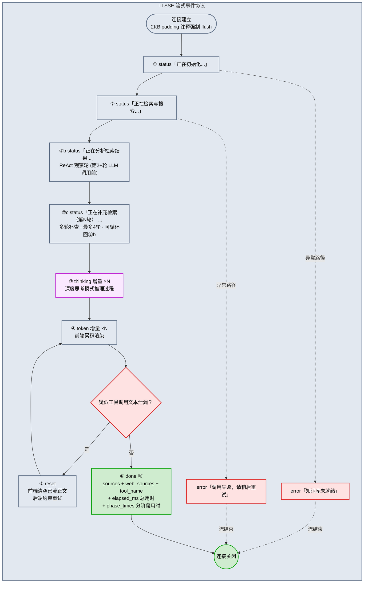
```mermaid
flowchart LR
  subgraph SSE["📡 SSE 流式事件协议"]
    direction TB
    E0(["连接建立<br/>2KB padding 注释强制 flush"]) --> E1["① status「正在初始化...」"]
    E1 --> E2["② status「正在检索与搜索...」"]
    E2 --> E2b["②b status「正在分析检索结果...」<br/>ReAct 观察轮 (第2+轮 LLM 调用前)"]
    E2b --> E2c["②c status「正在补充检索（第N轮）...」<br/>多轮补查 · 最多4轮 · 可循环回②b"]
    E2c --> E3["③ thinking 增量 ×N<br/>深度思考模式推理过程"]
    E3 --> E4["④ token 增量 ×N<br/>前端累积渲染"]
    E4 --> E5{"疑似工具调用文本泄漏？"}
    E5 -->|"是"| E5b["⑤ reset<br/>前端清空已流正文<br/>后端约束重试"]
    E5b --> E4
    E5 -->|"否"| E6["⑥ done 帧<br/>sources + web_sources + tool_name<br/>+ elapsed_ms 总用时<br/>+ phase_times 分阶段用时"]
    E1 -.->|"异常路径"| ER1["error「知识库未就绪」"]
    E2 -.->|"异常路径"| ER2["error「调用失败，请稍后重试」"]
    ER1 -.->|"流结束"| ENDD(("连接关闭"))
    ER2 -.->|"流结束"| ENDD
    E6 --> ENDD
  end

  classDef cSSE fill:#e2e8f0,stroke:#64748b,stroke-width:2px,color:#0b0b0b;
  classDef cTH fill:#fae8ff,stroke:#c026d3,stroke-width:2px,color:#0b0b0b;
  classDef cOK fill:#cfeccf,stroke:#0ca30c,stroke-width:2px,color:#0b0b0b;
  classDef cERR fill:#fee2e2,stroke:#dc2626,stroke-width:2px,color:#0b0b0b;
  class E0,E1,E2,E2b,E2c,E4,E5b cSSE;
  class E3 cTH;
  class E6,ENDD cOK;
  class ER1,ER2,E5 cERR;
  style SSE fill:#e2e8f0,stroke:#64748b,stroke-width:1.5px;
```

---

## 18. 前端交互与流式渲染（frontend/）

发送 → 「思考中」占位消息 → SSE 逐帧更新（status 覆盖占位文字 / token 累积 / thinking 累积 / reset 清空重来 / done 落库）；AbortController + 请求序号 + 会话 ID 三重防护防止旧流错写。

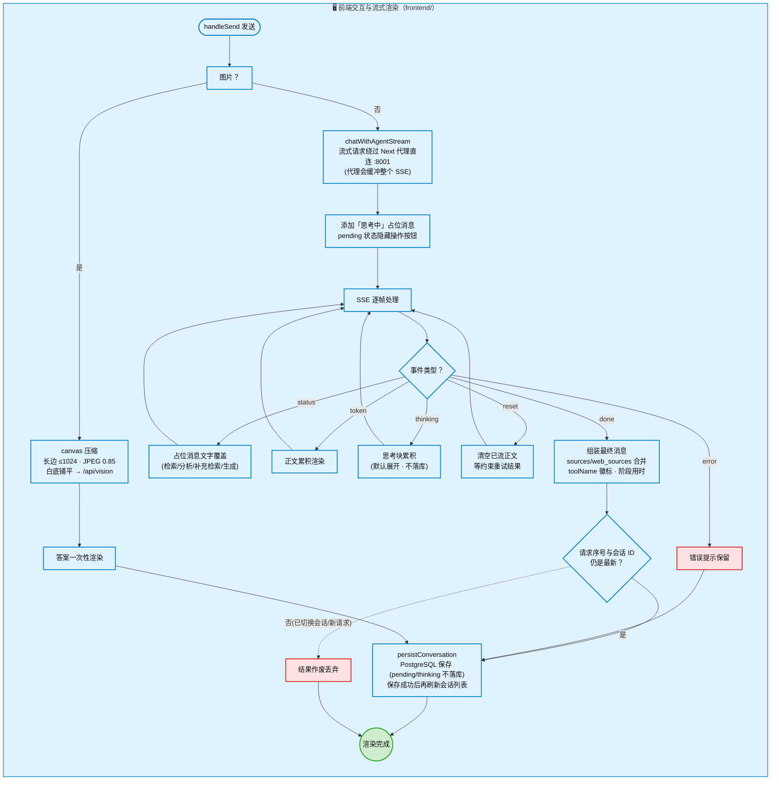
```mermaid
flowchart TB
  subgraph FE["🖥️ 前端交互与流式渲染（frontend/）"]
    direction TB
    F0(["handleSend 发送"]) --> F1["图片？"]
    F1 -->|"是"| F2["canvas 压缩<br/>长边 ≤1024 · JPEG 0.85<br/>白底铺平 → /api/vision"]
    F2 --> F3["答案一次性渲染"]
    F1 -->|"否"| F4["chatWithAgentStream<br/>流式请求绕过 Next 代理直连 :8001<br/>(代理会缓冲整个 SSE)"]
    F4 --> F5["添加「思考中」占位消息<br/>pending 状态隐藏操作按钮"]
    F5 --> F6["SSE 逐帧处理"]
    F6 --> F7{"事件类型？"}
    F7 -->|"status"| F8["占位消息文字覆盖<br/>(检索/分析/补充检索/生成)"]
    F7 -->|"token"| F9["正文累积渲染"]
    F7 -->|"thinking"| F10["思考块累积<br/>(默认展开 · 不落库)"]
    F7 -->|"reset"| F11["清空已流正文<br/>等约束重试结果"]
    F7 -->|"done"| F12["组装最终消息<br/>sources/web_sources 合并<br/>toolName 徽标 · 阶段用时"]
    F7 -->|"error"| F13["错误提示保留"]
    F8 & F9 & F10 & F11 --> F6
    F12 --> F14{"请求序号与会话 ID<br/>仍是最新？"}
    F14 -->|"是"| F15["persistConversation<br/>PostgreSQL 保存 (pending/thinking 不落库)<br/>保存成功后再刷新会话列表"]
    F14 -.->|"否(已切换会话/新请求)"| F16["结果作废丢弃"]
    F13 --> F15
    F3 --> F15
    F15 --> F17(("渲染完成"))
    F16 --> F17
  end

  classDef cFE fill:#e0f2fe,stroke:#0284c7,stroke-width:2px,color:#0b0b0b;
  classDef cOK fill:#cfeccf,stroke:#0ca30c,stroke-width:2px,color:#0b0b0b;
  classDef cERR fill:#fee2e2,stroke:#dc2626,stroke-width:2px,color:#0b0b0b;
  class F0,F1,F2,F3,F4,F5,F6,F7,F8,F9,F10,F11,F12,F14,F15 cFE;
  class F17 cOK;
  class F13,F16 cERR;
  style FE fill:#e0f2fe,stroke:#0284c7,stroke-width:1.5px;
```

---

## 19. 限流器（src/rate_limiter.py）

滑动窗口限流（30 req/60s / 每客户端 IP）：**检查+记录在同一把锁内**防止并发绕过；过期客户端条目定期清理防内存膨胀。⚠️ 状态在进程内，仅限单进程部署（当前 `main.py` 单 worker uvicorn；多进程需换 Redis）。

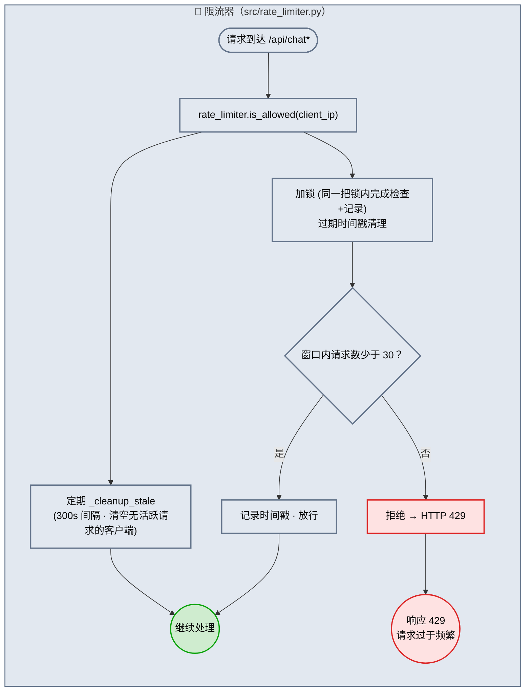
```mermaid
flowchart TB
  subgraph RL["🚦 限流器（src/rate_limiter.py）"]
    direction TB
    RL0(["请求到达 /api/chat*"]) --> RL1["rate_limiter.is_allowed(client_ip)"]
    RL1 --> RL2["加锁 (同一把锁内完成检查+记录)<br/>过期时间戳清理"]
    RL2 --> RL3{"窗口内请求数少于 30？"}
    RL3 -->|"是"| RL4["记录时间戳 · 放行"]
    RL3 -->|"否"| RL5["拒绝 → HTTP 429"]
    RL1 --> RL6["定期 _cleanup_stale<br/>(300s 间隔 · 清空无活跃请求的客户端)"]
    RL4 --> RL7(("继续处理"))
    RL5 --> RL8(("响应 429<br/>请求过于频繁"))
    RL6 --> RL7
  end

  classDef cRL fill:#e2e8f0,stroke:#64748b,stroke-width:2px,color:#0b0b0b;
  classDef cOK fill:#cfeccf,stroke:#0ca30c,stroke-width:2px,color:#0b0b0b;
  classDef cERR fill:#fee2e2,stroke:#dc2626,stroke-width:2px,color:#0b0b0b;
  class RL0,RL1,RL2,RL3,RL4,RL6 cRL;
  class RL7 cOK;
  class RL5,RL8 cERR;
  style RL fill:#e2e8f0,stroke:#64748b,stroke-width:1.5px;
```

---

## 20. 评测与测试（eval/ + tests/）

三条评测线：RAG 质量（LLM-as-Judge：Faithfulness / Relevancy / Recall）、Agent 端到端（工具选择准确率 + 延迟，同一故障容忍模式）、运行看板（feedback + 缓存统计）；pytest 全量 131 例（`uv run pytest -q`）。

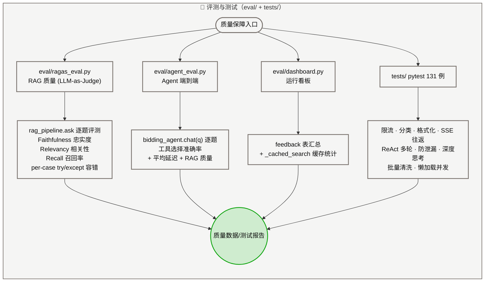
```mermaid
flowchart TB
  subgraph EVAL["🧪 评测与测试（eval/ + tests/）"]
    direction TB
    V0(["质量保障入口"]) --> V1["eval/ragas_eval.py<br/>RAG 质量 (LLM-as-Judge)"]
    V1 --> V2["rag_pipeline.ask 逐题评测<br/>Faithfulness 忠实度<br/>Relevancy 相关性<br/>Recall 召回率<br/>per-case try/except 容错"]
    V0 --> V3["eval/agent_eval.py<br/>Agent 端到端"]
    V3 --> V4["bidding_agent.chat(q) 逐题<br/>工具选择准确率<br/>+ 平均延迟 + RAG 质量"]
    V0 --> V5["eval/dashboard.py<br/>运行看板"]
    V5 --> V6["feedback 表汇总<br/>+ _cached_search 缓存统计"]
    V0 --> V7["tests/ pytest 131 例"]
    V7 --> V8["限流 · 分类 · 格式化 · SSE 往返<br/>ReAct 多轮 · 防泄漏 · 深度思考<br/>批量清洗 · 懒加载并发"]
    V2 & V4 & V6 & V8 --> V9(("质量数据/测试报告"))
  end

  classDef cEV fill:#f5f5f4,stroke:#78716c,stroke-width:2px,color:#0b0b0b;
  classDef cOK fill:#cfeccf,stroke:#0ca30c,stroke-width:2px,color:#0b0b0b;
  class V0,V1,V2,V3,V4,V5,V6,V7,V8 cEV;
  class V9 cOK;
  style EVAL fill:#f5f5f4,stroke:#78716c,stroke-width:1.5px;
```
