# Agent推理模式

## 一、单Agent推理范式

### 1.1 三种模式简介

ReAct、Plan-and-Solve 和 Reflection 是构建 AI Agent（智能体）的三种核心思维模式。它们的主要区别在于**处理任务的流程不同**：

- ReAct 是“**边想边做**”；
- Plan-and-Solve 是“**先想后做**”；
- Reflection 则是“**做完再想（反思）**”。

| 特性         | ReAct (Reason + Act)                                        | Plan-and-Solve                                               | Reflection                                                   |
| :----------- | :---------------------------------------------------------- | :----------------------------------------------------------- | :----------------------------------------------------------- |
| **核心思想** | **推理与行动交错进行**，在动态交互中逐步推进。              | **先规划再执行**，将复杂任务分解为步骤后按计划执行。         | **生成-反思-优化**的迭代循环，通过自我批判提升质量。         |
| **工作流程** | `思考(Thought) -> 行动(Action) -> 观察(Observation)` 循环。 | `制定计划(Plan) -> 按计划逐步执行(Solve)`。                  | `生成初稿(Draft) -> 自我批判(Critique) -> 修改完善(Revise)`。 |
| **优势**     | **高可解释性**、**动态纠错**、与外部工具协同能力强。        | **结构性强**、**稳定性高**、目标一致性好，不易偏离轨道。     | **显著提升答案质量**、**鲁棒性强**，能发现并修复深层逻辑漏洞。 |
| **劣势**     | 对模型推理能力依赖强、效率相对较低、提示词设计较脆弱。      | 计划一旦生成便**难以修改**，缺乏对突发情况的动态调整能力。   | **API 调用成本高**、**延迟大**、提示工程复杂。               |
| **资源消耗** | 中等，通常**1-15次** LLM调用                                | 中等，通常**2-16次** LLM调用                                 | 高，通常**3-45次** LLM调用                                   |
| **适用场景** | **探索性任务**、需要实时信息查询、动态交互的场景。          | **逻辑清晰、步骤固定**的复杂任务，如多步数学题、报告撰写、代码生成。 | **对结果质量要求极高**的场景，如关键业务代码、学术研究、深度分析。 |

### 1.2 ReAct

ReAct = **Reasoning（推理）** + **Acting（行动）**，是一种让大语言模型**交替进行思考与执行**的范式[^5]。它在生成答案的过程中，显式地输出：

```
Thought → Action → Observation → (循环) → Final Answer
```

**流程图**

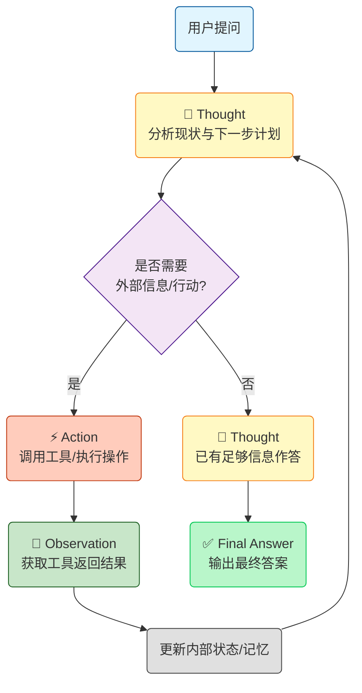

- **Thought**：模型内部对当前状况的分析与下一步规划。
- **Action**：模型调用外部工具或执行具体操作（如搜索、计算、查数据库）。
- **Observation**：工具或环境返回的观察结果。
- **循环**：根据观察结果继续思考、行动，直至得出最终答案。

**时序图**

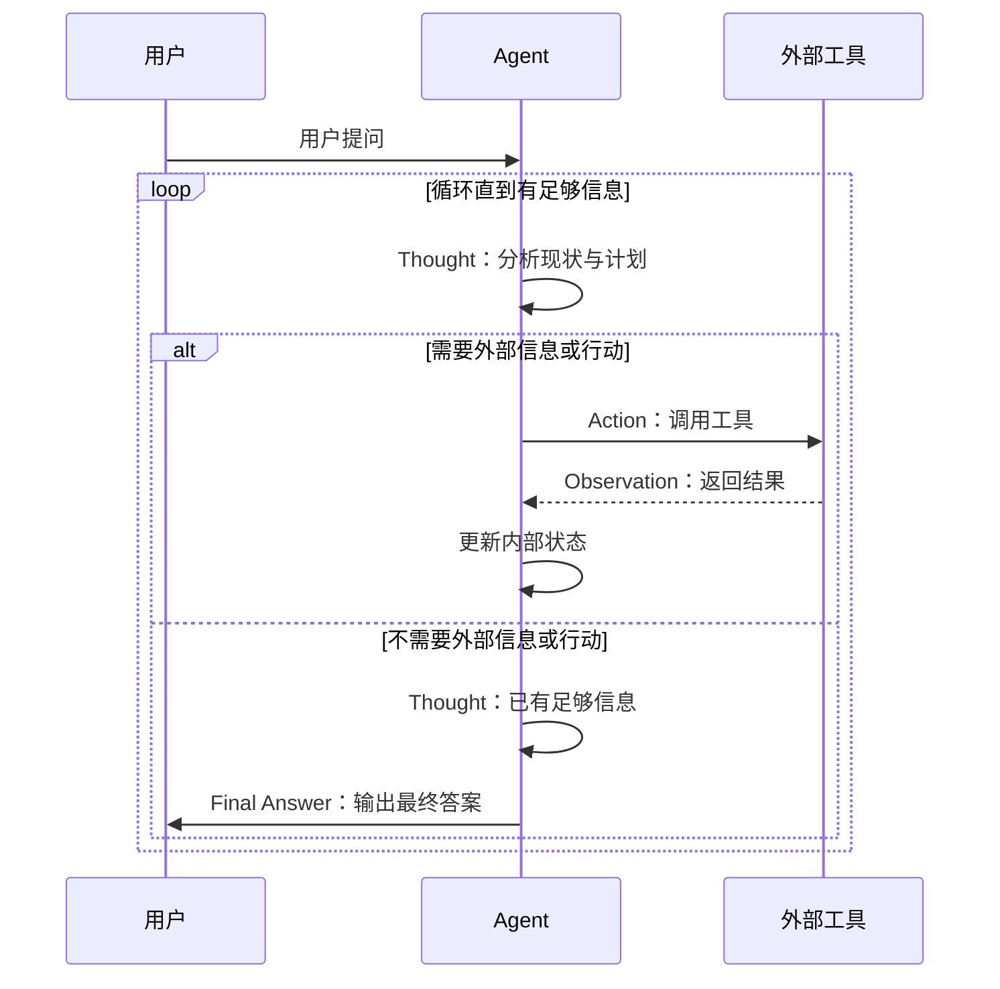

**核心价值**

1. **可解释性**：用户或开发者能看到模型每一步的“内心想法”和决策依据。
2. **减少幻觉**：每一步行动都有外部观察作为事实支撑，而非纯凭记忆生成。
3. **错误恢复**：若 Observation 与预期不符，Thought 可以动态调整策略。
4. **与工具深度结合**：天然适合接入搜索引擎、计算器、API、代码解释器等。

**适合的任务类型**

1. **知识密集型**：如多跳问答、事实验证。它能拆解问题并调用搜索工具获取信息，减少幻觉。

2. **交互决策型**：如网页浏览、自动化操作。它能根据环境反馈动态调整策略，支持试错纠错。

   总之，必须依赖外部工具与多步规划的任务最适合。

**局限性**

1. **成本与延迟高**：多轮循环导致响应慢、Token消耗大，易受上下文窗口限制。
2. **可靠性不足**：易陷入逻辑错误坍塌，且高度依赖提示词设计和工具的稳定性。
3. **缺乏全局规划**：面对长链路复杂任务易陷入局部最优，不如“计划-执行”模式高效。

**调试技巧**

1. **审查思维链**：追踪Thought，定位逻辑断点及幻觉。
2. **隔离测试工具**：确保工具返回格式精简稳定，过滤冗余噪音。
3. **补全边界Prompt**：增加工具报错、找不到结果等异常情况的处理指令。
4. **单步断点调试**：截取失败节点的上下文单独测试，区分是“想法错”还是“参数错”。
5. **监控上下文**：防范长对话导致的记忆遗忘或约束丢失。
6. **回归测试集**：收集死循环等坏案例，防随机性引发的回归问题。

**ReAct 示例**

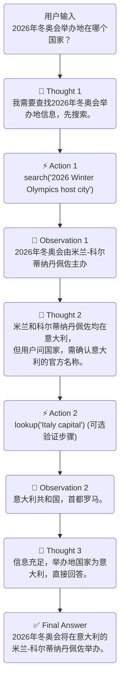

### 1.3 Plan-and-Solve

Plan-and-Solve 模式的核心思想是 **“先全局规划，再按步执行”** 。它把一个复杂的任务清晰地拆分为两个独立的阶段，从而让 AI 的行为更可控、目标更明确。

**流程图**

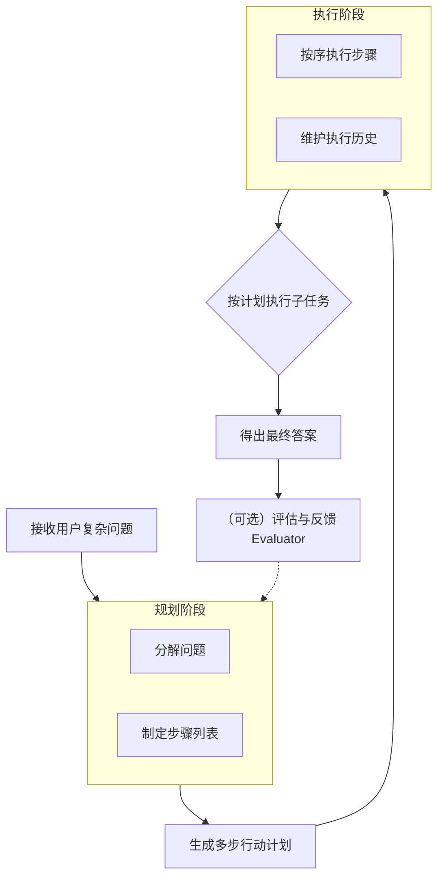

**三个核心组件：**

- **规划器 (Planner)**：负责接收用户的问题，并制定出一个清晰、分步骤的行动计划。
- **执行器 (Solver/Executor)**：严格按照规划器生成的计划，逐步执行每一个子任务。
- **评估器 (Evaluator)**：负责对执行结果进行反馈和评估，以便后续优化。

**时序图**

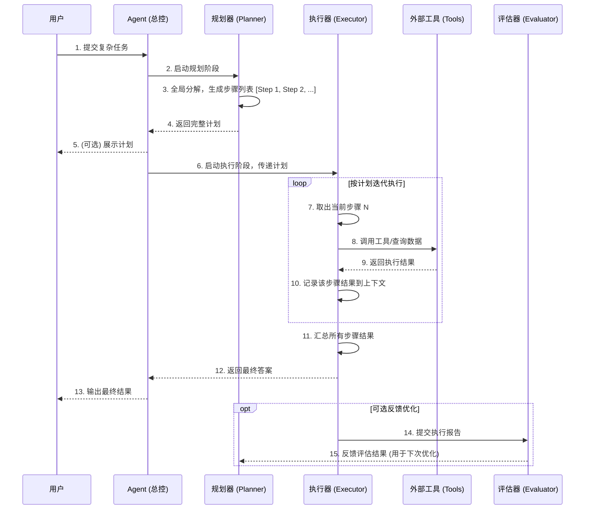

**核心价值**

1. **提升复杂推理准确率**：通过强制性的“规划阶段”分解任务，显著减少多步推理中的步骤遗漏。在数学与逻辑基准测试中，相比思维链（CoT），准确率可稳定提升 **3-8个百分点**。
2. **增强可解释性与可控性**：生成的显式步骤列表使思考过程透明化，用户可在执行前审查计划，提高系统可控性。
3. **工程化与模块化**：规划与执行职责分离，易于维护和优化，被认为是“**单一最高ROI的Prompt改动**”，无需微调模型即可带来显著性能提升。

**适用的任务类型**

- **多步数学应用题**：如“一个水果店周一卖出了15个苹果，周二是周一的两倍，周三比周二少5个，请问三天总共卖了多少？”。
- **需要整合多源信息的报告撰写**：可以预先规划报告结构（如引言、数据来源A、数据来源B、总结），再逐一填充内容。
- **代码生成任务**：先构思好函数、类和模块的整体结构，再逐一实现。

**局限性**

1. **规划能力依赖模型**：计划质量高度依赖LLM的推理能力，模型不足时可能产生错误或模糊的计划。
2. **执行僵化与计划脱节**：计划一旦制定便相对僵化，难以动态调整。同时，模型可能执行时“忘记”计划，这是最致命的风险。
3. **成本与适配性**：生成计划消耗额外Token，对简单任务性价比低。对目标模糊的创意类任务，难以生成有效计划。

**调试技巧**

1. **工程层面**：为规划器与执行器设立**独立日志**以定位问题；强制LLM输出JSON格式并使用安全函数解析；设置**重规划机制**，执行失败时反馈给规划器重新生成剩余步骤。
2. **提示词层面**：执行提示词中明确要求“**严格按照以下计划执行**”并附上完整计划；要求模型输出时引用“**计划中的第N步**”防止脱节；在规划提示词中提供1-2个高质量示例（Few-shot）引导生成更优计划。

### 1.4 Plan-and-Execute

Plan-and-Execute模式先制定一个完整的执行计划，再严格按照计划逐步执行。如果执行中遇到问题，可以重新规划。

**流程图**

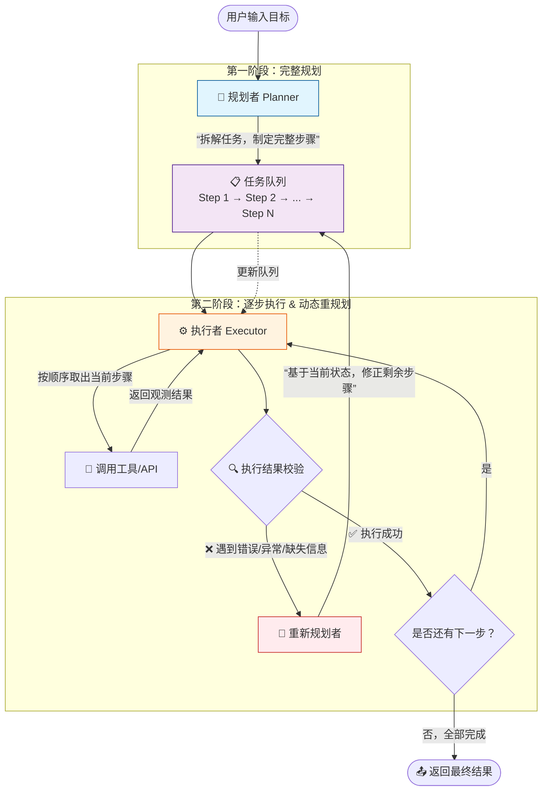

- **规划者（Planner）**：任务启动时一次性拆解目标为完整有序的子任务清单，只推理不执行，产出固定任务队列。
- **执行者（Executor）**：严格按队列顺序调用工具执行并收集结果，只执行不思考，无权修改计划。
- **重规划者（Re-planner）**：仅在执行报错时介入，结合已完成上下文对剩余步骤精准增删改，产出更新队列。

### 1.5 Reflection

Reflection（反思）是一种让 Agent 在生成输出后，主动回顾、评估并修正自身结果的机制[^7]。它打破了传统 LLM "一次性生成" 的局限，引入了内在的自我监督循环。

**流程图**

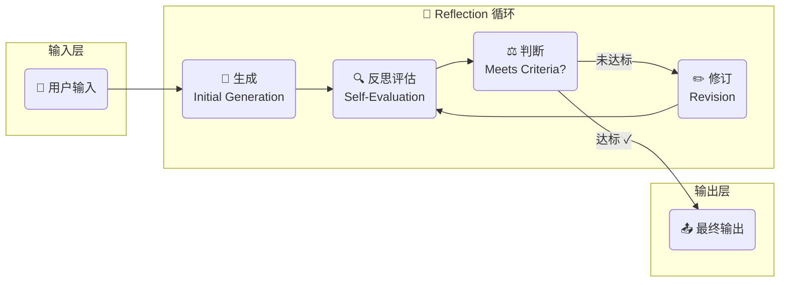

- **生成**：Agent 基于用户任务和上下文，产出初始回答或行动方案。
- **反思评估**：Agent 扮演"评审者"角色，从准确性、完整性、逻辑性等维度对输出打分。
- **判断**：将评估结果与预设的质量标准对比，决定是输出还是继续迭代。
- **修订**：结合反思中识别的具体问题，定向修改输出，而非从零开始重新生成。

**时序图**

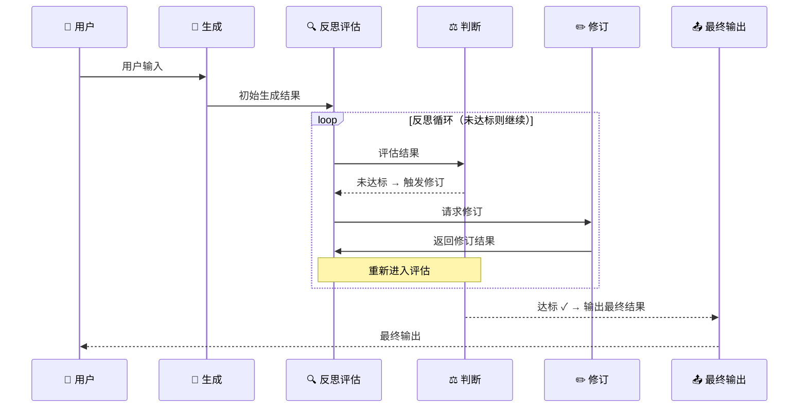

**核心价值**

- **自我纠错**：主动发现并修复输出缺陷
- **质量提升**：迭代优化，突破单次生成上限
- **减少人工**：内置评审，降低外部监督成本
- **增强鲁棒**：复杂推理场景下显著提高准确率

**适合的任务类型**

- **数学推理**：验证步骤逻辑，纠正计算错误
- **代码生成**：自测用例，修复语法与逻辑Bug
- **长文写作**：多轮自我审校结构、连贯性
- **知识问答**：交叉核验事实，减少幻觉
- **复杂决策**：多维度权衡，弥补单次思考盲区

**局限性**

- **成本倍增**：多轮调用大幅增加Token消耗
- **延迟拉高**：迭代循环导致响应变慢
- **空泛反思**：可能产出无效评价，无法定位真问题
- **无限循环**：缺乏兜底策略时易陷入死循环
- **自我盲区**：难以发现自身根本性认知错误

**调试技巧**

- **打印轨迹**：记录每轮生成内容与反思评分，定位无效迭代节点。
- **固化评估**：将评审Prompt拆解为独立可测模块，确保打分标准一致。
- **抽样反思**：人工抽检反思文本，识别"空泛评价"并补充具体示例约束。
- **阈值调优**：从低阈值起步逐步收紧，观察通过率与质量的拐点。
- **版本对比**：并排展示v1与v2差异，验证修订是否真正响应了反馈。
- **成本监控**：统计各任务平均迭代轮次，识别异常高耗场景。

**内部机制详解**

Reflection 的实现并非简单的"再问一次"。它依赖精心设计的 Prompt 策略和结构化评估框架，确保反思具有针对性和可操作性。

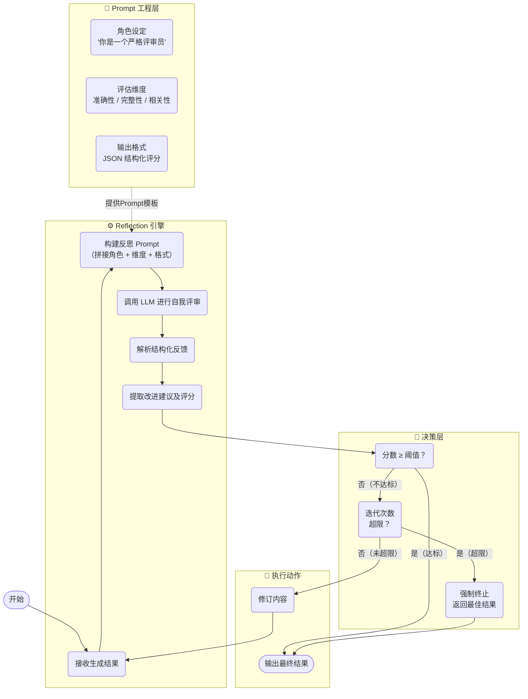

**完整工作流时序**

以下时序图展示了双 Agent 模式下一次完整的 Reflection 工作流，包含两轮反思迭代的典型场景。

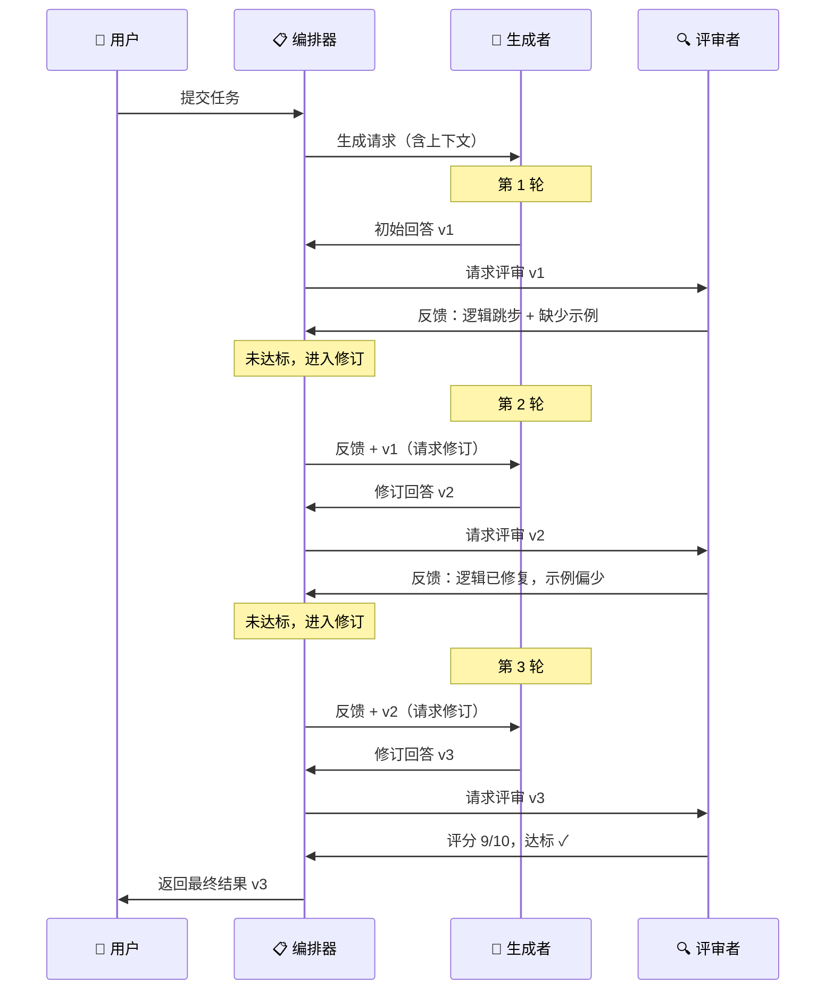

## 二、多Agent协作模式

### 2.1 三种模式简介

这三种模式代表了多智能体协作中从**静态到动态**、从**线性到并行**的不同复杂度。简单来说：

- **链式/流水线**是“流水线”，步骤固定，依次进行。
- **简单并行化**是“多窗口同时办公”，任务独立，齐头并进。
- **Orchestrator-Workers**则是“项目经理带队”，动态拆解，专家分工。

下表是它们核心差异的快速对比：

| 对比维度        | **链式/流水线 (Chain/Pipeline)**                             | **简单并行化 (Parallelization)**                             | **Orchestrator-Workers (编排-工作者)**                       |
| :-------------- | :----------------------------------------------------------- | :----------------------------------------------------------- | :----------------------------------------------------------- |
| **核心思想**    | **线性接力**：将任务拆解为一系列**固定顺序**的步骤，前一步的输出是后一步的输入。 | **齐头并进**：将任务拆解为**多个独立**的子任务，**同时**执行，最后汇总结果。 | **动态调度**：由一个中央“ orchestrator ”动态分析任务、拆解并分发给专门的“ workers ”，最后整合结果。 |
| **任务拆解**    | **预先定义**，流程在代码中写死。                             | **预先定义**，哪些子任务可并行是事先知道的。                 | **动态生成**，由 Orchestrator 根据输入实时决定如何拆解、拆成几个任务。 |
| **执行方式**    | **严格串行**，步骤A完成才能开始步骤B。                       | **并发执行**，所有独立子任务同时进行。                       | **先拆解，后并行**：Orchestrator 分解任务后，将子任务**并行**分发给 Workers 执行。 |
| **通信方式**    | **单向传递**，信息只沿链向下流动。                           | **独立无通信**，子任务之间互不干扰。                         | **星型拓扑**：所有 Workers 只与中心的 Orchestrator 通信，彼此不直接交流。 |
| **LLM调用次数** | **较多**，等于步骤数量。                                     | **与子任务数量相同**（可并行）。                             | **较多**，包括 Orchestrator 的规划、合成及各 Worker 的调用。 |
| **灵活性**      | **极低**，流程固定，难以应对突发变化。                       | **低**，仅在于并行执行本身，任务拆解是固定的。               | **高**，Orchestrator 可根据任务难度动态调整 Worker 数量和分工。 |
| **适用场景**    | 步骤清晰、顺序固定的任务，如内容生成流水线。                 | 多个独立的、无依赖的子任务，如多源信息收集。                 | 复杂、开放，需专家协作的任务，如软件研发、深度研究。         |

### 2.2 Chain/Pipeline

这是最直观的模式，将复杂任务分解为一系列**固定顺序**的步骤。每个步骤都是一个LLM调用或一个处理单元，其输出直接作为下一步的输入。

**流程图**

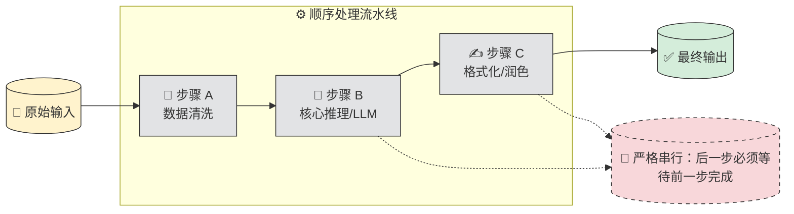

- **工作流程**：`输入 → 步骤A → 步骤B → 步骤C → ... → 输出`
- **优点**：**逻辑清晰、可解释性强**，每个步骤职责单一，便于调试和优化。
- **缺点**：**缺乏灵活性**，任何步骤的延迟都会阻塞整个流程；**错误会累积**，前一步的问题会传导至后续所有步骤。
- **典型场景**：**内容生成流水线**（如从营销要点生成领英帖子），或**多步计算与推理**任务。

**时序图**

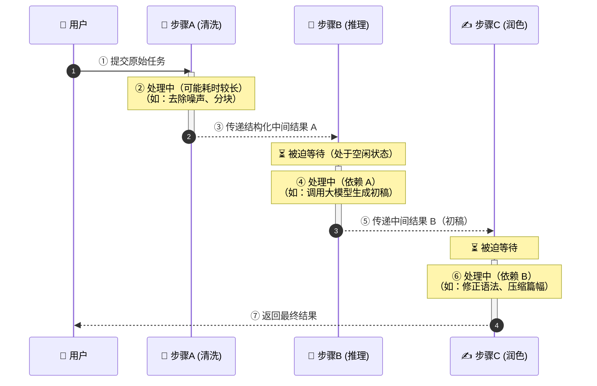


### 2.3 Parallelization

该模式用于处理**多个相互独立**的子任务。核心思想是“分而治之，同时进行”，从而**大幅降低总耗时**。

**流程图**

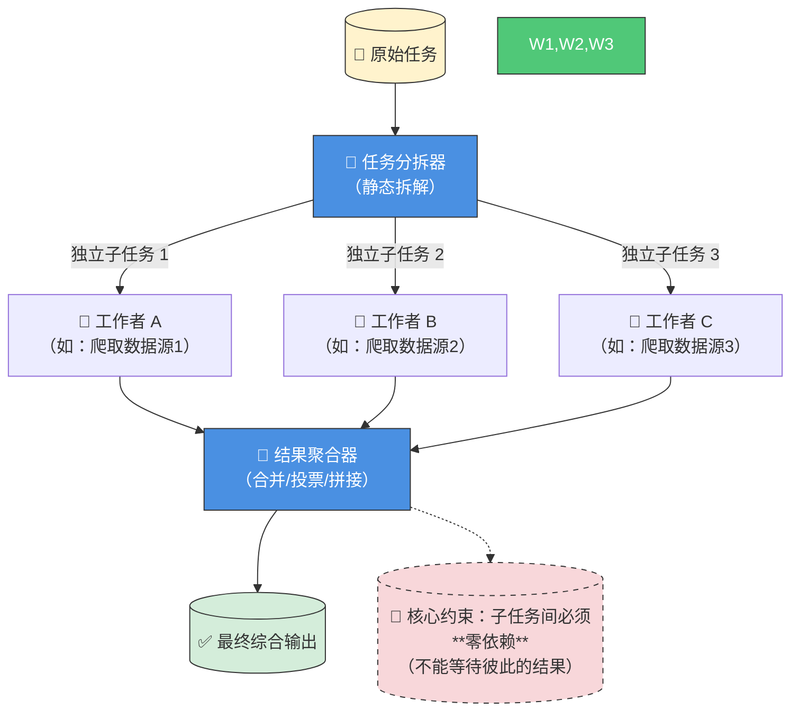


- **工作流程**：`输入 → [子任务A (并行) 子任务B (并行) 子任务C (并行)] → 汇总 → 输出`
- **优点**：**显著降低延迟**，尤其适用于I/O密集型任务（如多个API调用）。
- **缺点**：子任务必须**完全独立**，无法处理有依赖关系的步骤；汇总（Reduce）阶段可能成为新的瓶颈。
- **典型场景**：**多源信息收集**（如同时搜索新闻、股票、社交媒体），或对一份数据进行**多维度分析**（如同一产品的特性、优缺点、情感分析）。

**时序图**

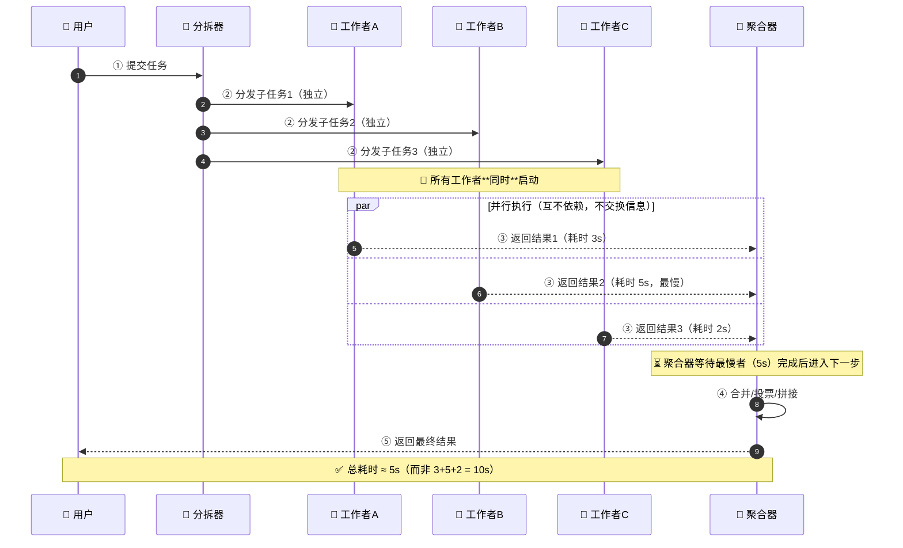


### 2.4 Orchestrator-Workers

这是最复杂也最强大的模式，适用于高度复杂的任务。它引入一个中央“**Orchestrator**”（编排者）作为项目经理，负责动态地将任务分解为子任务，并分发给多个专门的“**Workers**”（工作者）执行。

**流程图**

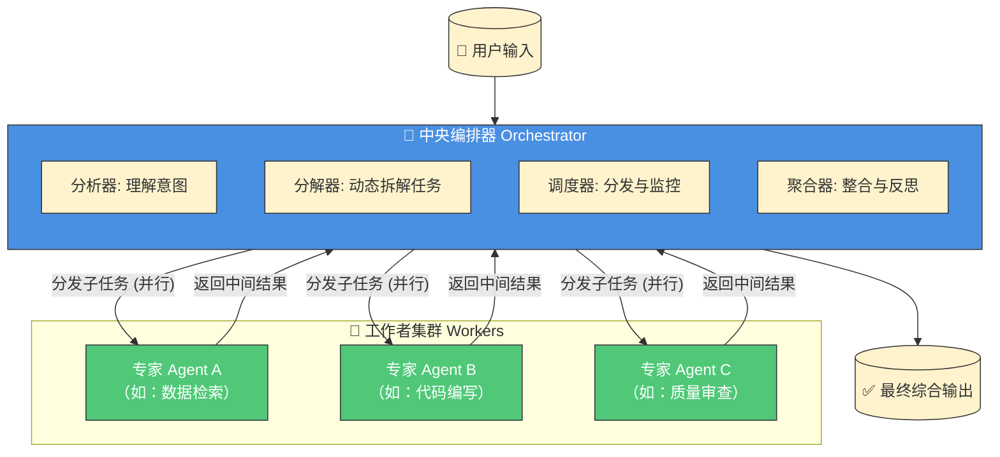

- **工作流程**：`输入 → Orchestrator(分解任务) → [Worker A (并行) Worker B (并行) Worker C (并行)] → Orchestrator(整合结果) → 输出`
- **优点**：**动态性与适应性强**，Orchestrator 可根据输入灵活调整策略；通过**专家分工**提升复杂任务的质量。
- **缺点**：**架构和成本复杂**，多次LLM调用导致Token消耗巨大，约为单次对话的**15倍**；Orchestrator 是**单点故障和性能瓶颈**。
- **典型场景**：**复杂软件开发**（如安排一个“经理”Agent分配任务，多个“开发”、“测试”Agent协作），或**深度研究分析**。

**时序图**

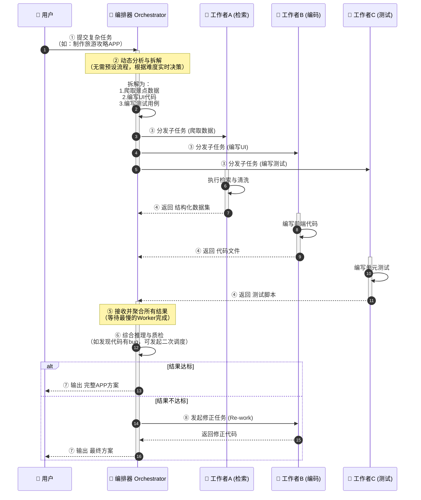


### 2.5 选择建议

选择哪种模式，本质上是在**可预测性、效率与灵活性**之间做权衡：

- 如果任务**步骤清晰、顺序固定**，追求稳定和可解释性，选择 **链式/流水线**。
- 如果任务包含**大量独立、无依赖的子任务**，核心目标是**降本增效**，选择 **Parallelization**。
- 如果任务**极其复杂、开放**，需要专家协作和动态规划，并且能接受较高的成本和架构复杂度，选择 **Orchestrator-Workers**。

正如Anthropic所建议的，**应从最简单的解决方案开始**，只有当简单模式无法满足需求时，再逐步引入更复杂的模式。