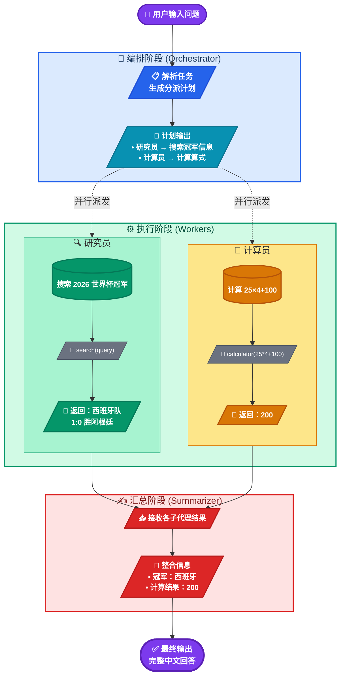

# Orchestrator-Workers（编排-执行）模式

**Agent Orchestrator-Workers（编排-执行）模式**是一种多智能体（Multi-Agent）架构设计范式，旨在通过一个中心化的“协调者”来管理、分解任务，并将其分发给多个专业化的“执行者”。它主要解决单个AI智能体在处理高度复杂、多领域任务时，因上下文过长、工具集庞杂而导致的性能瓶颈和易出错问题。

其核心思想是引入一个“项目经理”角色，它不负责具体执行，而是负责规划、调度与整合。

## 图解

Orchestrator-Workers模式工作机制图解。


**图解说明**

上图清晰展示了 **Orchestrator-Workers（编排-工作者）模式** 的完整工作流，共分为四个阶段：

1. **🧠 编排阶段（Orchestrator）**  
   - 接收用户提出的复合任务（既需要搜索，又需要计算）。  
   - 由 Orchestrator 解析任务并生成分派计划，将子任务分派给对应的子代理。

2. **⚙️ 执行阶段（Workers）**  
   - **研究员（Researcher）**：调用 `search` 工具，搜索“2026 年世界杯冠军”，返回西班牙队夺冠的信息。  
   - **计算员（Calculator）**：调用 `calculator` 工具，计算 `25×4+100`，返回结果 `200`。  
   - 两个子代理**并行执行**，互不干扰，提高效率。

3. **✍️ 汇总阶段（Summarizer）**  
   - **撰稿人（Writer）** 接收所有子代理的返回结果。  
   - 将“冠军信息”与“计算结果”整合成一段完整、流畅的中文回答。

4. **✅ 最终输出**  
   - 输出经过整合的最终答案，交付给用户。


## 运行结果

```
uv run python subagents.py
```

\=== 子智能体（Orchestrator-Workers）模式 ===
可用子智能体: 研究员(工具: search), 计算员(工具: calculator), 撰稿人(无工具)

请输入你的问题: 请完成下面两件事，并把结果整合成一段完整的中文回答：1) 搜索 2026 年世界杯冠军球队及其所在的国家；2) 计算 25 乘以 4 再加 100 的结果。

\=== 编排阶段 ===
生成的分派计划：

1. [研究员] 请搜索 2026 年世界杯冠军球队及其所在的国家
2. [计算员] 请计算 25 乘以 4 再加 100 的结果


\=== 执行阶段 ===
--- 子智能体「研究员」执行中（1/2）---
Thought: （调用工具）
Action: search({"query": "2026年世界杯冠军 球队 国家"})
\--------------------------------------------------
Observation: 答案摘要: The 2026 FIFA World Cup champion is Spain, who defeated Argentina 1-0 in the final. Spain's victory makes them the first team to win both the UEFA European Championship and the FIFA World Cup in the 21st century. The tournament was held in the United States, Canada, and Mexico.
搜索结果:

1. 2026年国际足联世界杯 (https://baike.baidu.com/item/2026%E5%B9%B4%E5%9B%BD%E9%99%85%E8%B6%B3%E8%81%94%E4%B8%96%E7%95%8C%E6%9D%AF/62863018)

   | 德国国家男子足球队 | 2025年11月18日 | 21 | 冠军（1954、1974、  1990、2014  共4次） | | 荷兰国家男子足球队 | 2025年11月18日 | 12 | 亚军（2010） | | 比利时国家男子足球队 | 2025年11月19日 | 15 | 季军（2018） | | 奥地利国家男子足球队 | 2025年11月19日 | 8 | 季军（1954） | |

2. 1：0 西班牙队赢得2026年世界杯足球冠军 (https://www.rfi.fr/cn/%E5%9B%BD%E9%99%85/20260719-1-0-%E8%A5%BF%E7%8F%AD%E7%89%99%E9%98%9F%E8%B5%A2%E5%BE%972026%E5%B9%B4%E4%B8%96%E7%95%8C%E8%B6%B3%E7%90%83%E5%86%A0%E5%86%9B)

   主题分类  # 1：0 西班牙队赢得2026年世界杯足球冠军  国际 –  这场堪称“巅峰之战”的世界杯于周日落下帷幕，阿根廷与西班牙两支风格迥异的球队在决赛中展开巅峰对决。这场精彩绝伦的比赛在纽约郊外举行，西班牙队在加时赛时以1：0战胜阿根廷队。  发表时间： 20/07/2026 - 00:21更改时间： 20/07/2026 - 00:27  Ferran Torres ivre de jo

3. 西班牙击败阿根廷获得2026年国际足联世界杯冠军 (https://www.voachinese.com/a/spain-world-cup-2026-0719/8173600.html)

   \## 无障碍链接   跳转到内容  跳转到导航  跳转到检索  ##### 关注我们  其他语言网站   site logo site logo  直播  site logo site logo  上一页   下一页   VOA快讯  中国时间 16:22 2026年8月23日 星期日  2026年世界杯  # 西班牙击败阿根廷获得2026年国际足联世界杯冠军  西班牙击败阿根廷获得2026年国际
\--------------------------------------------------
Thought: （调用工具）
Action: search({"query": "2026 FIFA World Cup winner champion"})
\--------------------------------------------------
Observation: 答案摘要: Spain won the 2026 FIFA World Cup, defeating Argentina in the final. They claimed their second title after a 1-0 victory in extra time. Spain also became the first nation to hold both men's and women's FIFA World Cup titles simultaneously.
搜索结果:

1. FIFA World Cup 2026™ Final (https://www.fifa.com/en/tournaments/mens/worldcup/canadamexicousa2026/final)

   Image 90  Image 91: wordmark 1 1  Spain claimed ultimate glory in front of a crowd of over 80,000 at New York New Jersey Stadium, as they were crowned FIFA World Cup™ champions on Sunday 19 July 2026.

2. FIFA World Cup - Wikipedia (https://en.wikipedia.org/wiki/FIFA_World_Cup)

   The FIFA World Cup is an international association football competition among the senior men's national teams of the members of the Fédération Internationale de Football Association (FIFA), the sport'

3. Who were the 2026 World Cup winners and losers? (https://impact.ed.ac.uk/opinion/who-were-the-2026-world-cup-winners-and-losers)

   Saying who the winners of the FIFA 2026 Men’s World Cup were is, at one level, an easy question to answer: Spain. The reigning European football champions defeated Argentina on 19 July at the MetLife
\--------------------------------------------------
子智能体「研究员」的结果: 根据搜索结果，我找到了关于 2026 年世界杯冠军球队的明确信息：

\## 2026 年世界杯冠军

**冠军球队：西班牙国家队（西班牙）**

关键事实与来源要点：

1. **决赛结果**：西班牙队在决赛中以 1:0 战胜阿根廷队，夺冠比分是在加时赛中打入的制胜球（来源：法国国际广播电台 RFI，2026年7月20日报道）。


2. **决赛时间与地点**：决赛于 2026 年 7 月 19 日（周日）在美国纽约/新泽西的纽约新泽西体育场（MetLife 体育场）举行，现场观众超过 8 万人（来源：FIFA 官网）。


3. **历史意义**：

   \- 这是西班牙队史第二个世界杯冠军（此前 2010 年曾夺冠）；
   \- 西班牙成为 21 世纪首支同时赢得欧洲杯与世界杯的球队；
   \- 西班牙也成为同时持有男足与女足世界杯冠军的国家（来源：爱丁堡大学评论文章、搜索结果摘要）。

4. **主办国**：本届世界杯由美国、加拿大、墨西哥三国联合举办。


\## 结论

**2026 年世界杯冠军球队是西班牙国家队，所在国家为西班牙。**

--- 子智能体「计算员」执行中（2/2）---
Thought: （调用工具）
Action: calculator({"expression": "25*4+100"})
\--------------------------------------------------
Observation: 200
\--------------------------------------------------
子智能体「计算员」的结果: 计算完成。

算式：25 × 4 + 100 = 100 + 100 = 200

**最终结果：200**

\=== 汇总阶段 ===
--- 子智能体「撰稿人」执行中（汇总）---
子智能体「撰稿人」的结果: 根据已有材料，2026年世界杯冠军球队是西班牙国家队，其所在国家为西班牙；该冠军在决赛中以1:0战胜阿根廷队，决赛于2026年7月19日在美国纽约/新泽西的纽约新泽西体育场（MetLife体育场）举行，这是西班牙队史第二个世界杯冠军。另外，需要计算的算式为25乘以4再加100，结果是200。

最终结果:
根据已有材料，2026年世界杯冠军球队是西班牙国家队，其所在国家为西班牙；该冠军在决赛中以1:0战胜阿根廷队，决赛于2026年7月19日在美国纽约/新泽西的纽约新泽西体育场（MetLife体育场）举行，这是西班牙队史第二个世界杯冠军。另外，需要计算的算式为25乘以4再加100，结果是200。