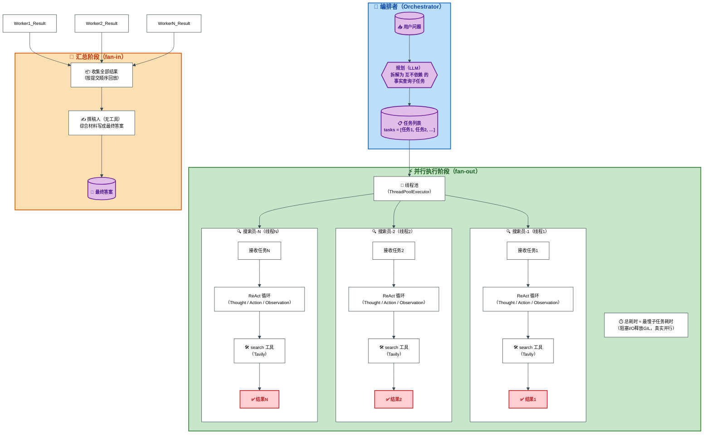

# Parallelization模式

## 图解

以下是**并行化模式（Agent Parallelization）工作机制图解**，清晰展示 **编排→并行执行（fan‑out）→汇总（fan‑in）** 全流程。



### 图解要点说明

| 阶段                    | 核心机制                                                     |
| ----------------------- | ------------------------------------------------------------ |
| **编排者**              | 由 LLM 将问题拆解成**相互独立**的事实查询任务（最多 `_MAX_TASKS` 个），确保没有数据依赖。 |
| **并行执行（fan‑out）** | 线程池为每个任务创建一个**同构搜索员**线程，每个搜索员运行独立的 ReAct 循环并调用 `search` 工具（Tavily）。<br>• 阻塞 I/O 期间释放 GIL，实现真并行。<br>• 每个线程拥有自己的日志缓冲区，主线程按提交顺序回放，**零锁零交错**。 |
| **汇总（fan‑in）**      | 撰稿人（无工具）接收所有搜索结果，综合成一段完整的中文答案。若撰稿人失败，编排者自行汇总作为兜底。 |

---

### 关键教学点呼应

- ✅ **计算进线程池，输出归主线程**：每个子任务的日志写入私有 `StringIO`，主线程串行回放，无需锁。
- ✅ **总耗时 ≈ 最慢子任务**：图中“⏱️ 总耗时 ≈ 最慢子任务耗时”直接体现并行收益。
- ✅ **子任务相互独立**：编排阶段强制拆分互不依赖的查询，有依赖则合并为同一个任务（图中未展示，但注释说明）。

## 运行结果

```
uv run python parallelization.py
```

\=== 并行化（Agent Parallelization）模式 ===
子智能体: 搜索员（并行搜索，全部同构——只有 search 一个工具，每个子任务动态创建一个新实例）

         + 撰稿人（fan-in 汇总，无工具，顺序执行）
提示: 本演示问题的两个子任务相互独立，适合并行执行（fan-out）——
有依赖的子任务只能顺序执行，请参见 orchestrator_workers.py

请输入你的问题: 2026 年世界杯冠军和亚军球队及其所在的国家

\=== 编排阶段 ===
生成的分派计划：

1. 请搜索2026年世界杯冠军球队及其所在的国家
2. 请搜索2026年世界杯亚军球队及其所在的国家

\=== 并行执行阶段（fan-out）===
已向线程池提交 2 个子任务（每个子任务一个搜索员线程，并行执行）...
--- 已提交 1/2：「请搜索2026年世界杯冠军球队及其所在的国家」（并行执行）
--- 已提交 2/2：「请搜索2026年世界杯亚军球队及其所在的国家」（并行执行）
等待全部子任务完成（并行总耗时 ≈ 最慢子任务）...
--- 子智能体「搜索员-1」执行回放（提交顺序 1/2，耗时 16.1 秒）---
Thought: （调用工具）

Action: search({"query": "2026年世界杯冠军"})
--------------------------------------------------
Observation: 答案摘要: The 2026 FIFA World Cup champion is Spain. They defeated Argentina 1-0 in the final. This is Spain's second World Cup title.
搜索结果:
1. 2026年国际足联世界杯_百度百科 (https://baike.baidu.com/item/2026%E5%B9%B4%E5%9B%BD%E9%99%85%E8%B6%B3%E8%81%94%E4%B8%96%E7%95%8C%E6%9D%AF/62863018)
   | 德国国家男子足球队 | 2025年11月18日 | 21 | 冠军（1954、1974、  1990、2014  共4次） | | 荷兰国家男子足球队 | 2025年11月18日 | 12 | 亚军（2010） | | 比利时国家男子足球队 | 2025年11月19日 | 15 | 季军（2018） | | 奥地利国家男子足球队 | 2025年11月19日 | 8 | 季军（1954） | |
2. 阿根廷将与西班牙争夺2026年世界杯冠军 (https://www.voachinese.com/a/argentina-spain-set-up-2026-world-cup-final-clash-20260715/8172213.html)
   卫冕冠军阿根廷正渴望捧得第四座世界杯冠军奖杯。阿根廷此前曾在1978年、1986年和2022年夺冠。  阿根廷以3比0击败阿尔及利亚开启本届赛事征程，随后在小组赛中以2比0战胜奥地利，并以3比0击败约旦。32强赛中，阿根廷在一场艰难比赛中以3比2击败佛得角，随后在16强赛中以同样比分战胜埃及。阿根廷把强劲势头延续到四分之一决赛，以3比1击败瑞士。  如果阿根廷赢得2026年世界杯，他们将加入巴西和
3. 2026年国际足联世界杯决赛 - 维基百科 (https://zh.wikipedia.org/zh-hans/2026%E5%B9%B4%E5%9C%8B%E9%9A%9B%E8%B6%B3%E5%8D%94%E4%B8%96%E7%95%8C%E7%9B%83%E6%B1%BA%E8%B3%BD)
   本届世界杯冠军由西班牙和阿根廷争夺。西班牙历史上参加过一次世界杯决赛，是在2010年，当时击败荷兰，夺得球队史上第一个世界杯冠军。本届决赛开始前，西班牙创下37场比赛常规时间不败的纪录，与意大利并列男子国家队比赛最长不败纪录。2024年欧洲足球锦标赛，西班牙2-1击败英格兰夺得欧洲杯冠军。阿根廷在上届世界杯夺得球队第三个世界杯冠军，前两个冠军分别占在1978年和1986年夺得，另外三次取得世界杯亚
--------------------------------------------------
Thought: （调用工具）
Action: search({"query": "2026 FIFA World Cup winner"})
--------------------------------------------------
Observation: 答案摘要: Spain won the 2026 FIFA World Cup by defeating Argentina in the final. This was Spain's second World Cup victory, their first being in 2010. The final took place on 19 July 2026 at MetLife Stadium in New Jersey.
搜索结果:
1. FIFA World Cup 2026™ Final (https://www.fifa.com/en/tournaments/mens/worldcup/canadamexicousa2026/final)
   Image 85  Image 86: wordmark 1 1  Spain claimed ultimate glory in front of a crowd of over 80,000 at New York New Jersey Stadium, as they were crowned FIFA World Cup™ champions on Sunday 19 July 2026.
2. Who were the 2026 World Cup winners and losers? (https://impact.ed.ac.uk/opinion/who-were-the-2026-world-cup-winners-and-losers)
   1. Silverman, A (2026). Spain wins World Cup, capping wildly successful North American tournament. Sports Business Journal, 19 July 2026. ↩︎ 2. Hughes, M (2026). Spain win the World Cup after Ferran T
3. FIFA World Cup - Wikipedia (https://en.wikipedia.org/wiki/FIFA_World_Cup)
   As of the 2026 World Cup, 23 tournaments have been held since the event's inception in 1930, and a total of 84 national teams have competed. The trophy has been won by eight national teams. With five
--------------------------------------------------
Thought: （调用工具）
Action: search({"query": "西班牙 2026世界杯 决赛 1-0 阿根廷 夺冠"})
--------------------------------------------------
Observation: 答案摘要: Spain won the 2026 World Cup final 1-0 against Argentina. Ferran Torres scored the decisive goal. Spain became the first European team to win the World Cup in North America.
搜索结果:
1. 2026年国际足联世界杯决赛 - 维基百科 (https://zh.wikipedia.org/zh-hans/2026%E5%B9%B4%E5%9C%8B%E9%9A%9B%E8%B6%B3%E5%8D%94%E4%B8%96%E7%95%8C%E7%9B%83%E6%B1%BA%E8%B3%BD)
   2026年国际足协世界杯决赛是2026年世界杯足球赛最后一场赛事，于2026年7月19日在美国新泽西州东卢瑟福的大都会人寿体育场（赛事期间称为“纽约新泽西体育场”）举行，由西班牙以1–0击败卫冕冠军阿根廷，赢得世界杯冠军，也是首次在北美洲夺冠的欧洲球队。阿根廷在90分钟常规时间内0射门，也由此成为了1966年有相关统计数据以来，世界杯历史上首支在决赛中常规时间内0射门的球队。阿根廷守门员埃米利亚诺
2. Instagram (https://www.instagram.com/p/Da_ZIxgkuw9)
   西班牙勇奪 2026 世界盃冠軍！面對上屆冠軍阿根廷，這支強悍球隊在決賽中表現出色，最終以 1:0 擊敗對手，這是他們自 2010 年首次奪冠後的第二次世界盃冠軍，再次登上足球之巔！      今場決賽十分精彩，西班牙表現穩定，以快速節奏不停進攻，但阿根廷也守得滴水不漏，兩支球隊於法定時間未能分出勝負；最後加時30分鐘，阿根廷能只以十人應戰，苦守之下仍被西班牙 Ferran Torres 射入關鍵
3. 世界杯丨西班牙队夺冠 (https://www.news.cn/sports/20260720/4b70ca4904b04b56a34f9e534f6fbae9/c.html)
   当地时间7月19日，在美国纽约新泽西体育场进行的2026美加墨世界杯足球赛决赛中，西班牙队1比0阿根廷队。    新华社记者 曹灿 摄    7月19日，阿根廷队球员梅西（左）在比赛中。    当地时间7月19日，在美国纽约新泽西体育场进行的2026美加墨世界杯足球赛决赛中，西班牙队1比0阿根廷队。    新华社记者 许畅 摄    7月19日，西班牙队球员费兰·托雷斯（右）进球后庆祝。    当
--------------------------------------------------
子智能体「搜索员-1」的结果: 搜索结果已核实，信息一致。现总结如下：

## 2026年世界杯冠军：西班牙队（国家：西班牙）

### 关键事实
1. **冠军球队**：西班牙国家男子足球队（西班牙队，位于欧洲）
2. **决赛信息**：2026年7月19日，在美国新泽西州东卢瑟福的大都会人寿体育场（赛事期间称"纽约新泽西体育场"）举行，西班牙队以 **1比0** 击败卫冕冠军阿根廷队
3. **制胜进球**：由西班牙球员**费兰·托雷斯（Ferran Torres）**打入
4. **夺冠意义**：
   - 这是西班牙队历史上**第二次**夺得世界杯冠军（首次为2010年南非世界杯）
   - 西班牙成为**首支在北美夺得世界杯冠军的欧洲球队**
   - 决赛开始前西班牙保持37场常规时间不败纪录，与意大利并列男子国家队最长不败纪录
   - 决赛现场观众超过8万人

### 信息要点（来源）
- 维基百科"2026年国际足联世界杯决赛"词条：详细记载决赛于2026年7月19日举行，西班牙1-0阿根廷夺冠
- 国际足联官网（FIFA.com）：确认西班牙于2026年7月19日在纽约新泽西体育场加冕世界杯冠军
...（已截断）

--- 子智能体「搜索员-2」执行回放（提交顺序 2/2，耗时 23.9 秒）---
Thought: （调用工具）
Action: search({"query": "2026年世界杯亚军球队"})
--------------------------------------------------
Observation: 答案摘要: The 2026 FIFA World Cup runner-up is Argentina, who finished second in the tournament. The final match was won by the host nation, Canada. The tournament featured 48 teams for the first time.
搜索结果:
1. 2026年国际足联世界杯_百度百科 (https://baike.baidu.com/item/2026%E5%B9%B4%E5%9B%BD%E9%99%85%E8%B6%B3%E8%81%94%E4%B8%96%E7%95%8C%E6%9D%AF/62863018)
   | 德国国家男子足球队 | 2025年11月18日 | 21 | 冠军（1954、1974、  1990、2014  共4次） | | 荷兰国家男子足球队 | 2025年11月18日 | 12 | 亚军（2010） | | 比利时国家男子足球队 | 2025年11月19日 | 15 | 季军（2018） | | 奥地利国家男子足球队 | 2025年11月19日 | 8 | 季军（1954） | |
2. 世界杯2026：赛制、分组与夺冠热门一次掌握 (https://www.bbc.com/zhongwen/articles/c0q2jvpenj8o/simp)
   图像来源，Getty Images  托马尔·图赫尔（Thomas Tuchel，杜曹）的球队以完美战绩晋级世界杯，赢得所有比赛且一球未失。他们拥有众多顶级球星，包括贝林汉（Jude Bellingham，比宁咸）和哈利·凯恩（Harry Kane，哈利·简尼）。  法国同样是强而有力的竞争者。德尚（Didier Deschamps，迪甘斯）的球队前线火力惊人，拥有巴尔科拉（Bradley Bar
3. 探索2026年世界杯的每支入围球队 - Ticombo (https://www.ticombo.com/zh/world-cup-2026/teams)
   体育  /  出售您的门票  FIFA 2026  在 Ticombo 上轻松、安全、快速地出售您的门票。  zh  zh  €  EUR  Bear  # 入围2026年世界杯的球队  ## 欧洲球队 - UEFA  ## 北美球队 - CONCACAF  海地加拿大库拉索巴拿马美国墨西哥  ## 南美球队 - CONMEBOL  技巧、激情与底蕴。作为卫冕冠军阿根廷和永恒的热门巴西的故乡，南美
--------------------------------------------------
Thought: （调用工具）
Action: search({"query": "2026 FIFA World Cup runner-up team"})
--------------------------------------------------
Observation: 答案摘要: The runner-up team of the 2026 FIFA World Cup was Argentina. Spain won the tournament. The final match took place on July 19, 2026.
搜索结果:
1. FIFA World Cup champions: 1982-2026 (https://www.fifa.com/en/tournaments/mens/worldcup/articles/world-cup-champions-1982-2026-italy-argentina-germany-brazil-france-spain)
   Watch the highlights from the match between Argentina and France played at Lusail Stadium, Lusail on Sunday, 18 December 2022.Watch the highlights from the match between Argentina and France played at
2. FIFA World Cup 2026™ Final (https://www.fifa.com/en/tournaments/mens/worldcup/canadamexicousa2026/final)
   Image 85  Image 86: wordmark 1 1  Spain claimed ultimate glory in front of a crowd of over 80,000 at New York New Jersey Stadium, as they were crowned FIFA World Cup™ champions on Sunday 19 July 2026.
3. Brackets, Standings & Group Tables | FIFA World Cup 2026™ (https://www.fifa.com/en/tournaments/mens/worldcup/canadamexicousa2026/standings)
   BEL  1  M99  Full time  Norway  Image 55  NOR  1  England  Image 56  ENG  2  M100  Full time  Argentina  Image 57  ARG  3  Switzerland  Image 58  SUI  1  M101  Full time  France  Image 59  FRA  0  Spa
--------------------------------------------------
Thought: （调用工具）
Action: search({"query": "2026世界杯决赛 西班牙 阿根廷 比分 冠军"})
--------------------------------------------------
Observation: 答案摘要: In the 2026 FIFA World Cup final, Spain defeated Argentina 1-0, winning the championship. The decisive goal was scored by Spain's Ferran Torres in extra time. Spain became the first European team to win the World Cup in North America.
搜索结果:
1. 2026年国际足联世界杯决赛 - 维基百科 (https://zh.wikipedia.org/zh-hans/2026%E5%B9%B4%E5%9C%8B%E9%9A%9B%E8%B6%B3%E5%8D%94%E4%B8%96%E7%95%8C%E7%9B%83%E6%B1%BA%E8%B3%BD)
   2026年国际足协世界杯决赛是2026年世界杯足球赛最后一场赛事，于2026年7月19日在美国新泽西州东卢瑟福的大都会人寿体育场（赛事期间称为“纽约新泽西体育场”）举行，由西班牙以1–0击败卫冕冠军阿根廷，赢得世界杯冠军，也是首次在北美洲夺冠的欧洲球队。阿根廷在90分钟常规时间内0射门，也由此成为了1966年有相关统计数据以来，世界杯历史上首支在决赛中常规时间内0射门的球队。阿根廷守门员埃米利亚诺
2. 世界杯丨西班牙队夺冠 (https://www.news.cn/sports/20260720/4b70ca4904b04b56a34f9e534f6fbae9/c.html)
   当地时间7月19日，在美国纽约新泽西体育场进行的2026美加墨世界杯足球赛决赛中，西班牙队1比0阿根廷队。    新华社记者 曹灿 摄    7月19日，阿根廷队球员梅西（左）在比赛中。    当地时间7月19日，在美国纽约新泽西体育场进行的2026美加墨世界杯足球赛决赛中，西班牙队1比0阿根廷队。    新华社记者 许畅 摄    7月19日，西班牙队球员费兰·托雷斯（右）进球后庆祝。    当
3. 西班牙击败阿根廷获得2026年国际足联世界杯冠军 (https://www.voachinese.com/a/spain-world-cup-2026-0719/8173600.html)
   评论  国际足联世界杯决赛7月19日举行，西班牙以1:0战胜阿根廷获得冠军。至此历史一个多月的世界杯落下帷幕。视频显示西班牙队的费兰·托雷斯在加时赛进球得分后，聚集在马德里的西班牙民众发出欢呼。  ### 评论区  ## 相关内容   16x9 Image    2026年世界杯  #### 西班牙在2026年世界杯决赛中获胜    参阅电视节目  参阅广播节目   [...] ## 无障碍链接
--------------------------------------------------
Thought: （调用工具）
Action: search({"query": "2026 World Cup final Spain Argentina score July 19 2026"})
--------------------------------------------------
Observation: 答案摘要: Spain won the 2026 World Cup final against Argentina with a score of 1-0 on July 19, 2026. Spain's victory secured their second World Cup title. The final took place at MetLife Stadium in New Jersey.
搜索结果:
1. Spain 1-0 Argentina (Jul 19, 2026) Final Score (https://www.espn.com/soccer/match/_/gameId/760517/argentina-spain)
   IT'S FULL TIME HERE AT NEW YORK NEW JERSEY STADIUM AND SPAIN ARE CROWNED WORLD CUP CHAMPIONS AFTER A 1-0 WIN OVER ARGENTINA IN THE 2026 FINAL! Spain's mission for a second World Cup crown is complete,
2. Spain 1 - 0 Argentina (07/19) - Match Report (https://www.365scores.com/football/match/fifa-world-cup-5930/argentina-spain-2378-5050-5930)
   See All  Ad  ### About Spain vs Argentina  The match between Spain and Argentina in the Final of FIFA World Cup, held on Sunday, July 19, 2026 at MetLife Stadium (New Jersey), ended with a score of Sp
3. Spain vs. Argentina - Final Score - July 19, 2026 | FOX Sports (https://www.foxsports.com/soccer/fifa-world-cup-men-spain-vs-argentina-jul-19-2026-game-boxscore-607934)
   BROWSE BY  Databricks Spain Argentina  ## H1 Spain vs  ## J1 Argentina  |  | 1 | 2 | ET | T |  ---  ---  | ESP  -  - | | ARG  -  - |  New York New Jersey Stadium  # 2026 FIFA Men's World Cup Final: Ju
--------------------------------------------------
子智能体「搜索员-2」的结果: 搜索结果已确认一致，可以给出结论。

## 搜索结论

**2026年世界杯亚军球队：阿根廷国家男子足球队（Argentina），其所在国家为阿根廷（南美洲国家）。**

### 关键事实
- 2026年世界杯决赛于当地时间 **2026年7月19日** 在美国新泽西州东卢瑟福的**大都会人寿体育场**（赛事期间称"纽约新泽西体育场"，New York New Jersey Stadium）举行。
- 决赛结果：**西班牙 1 : 0 阿根廷**。西班牙夺冠（历史上首次在北美洲夺冠的欧洲球队），**阿根廷获得亚军**。
- 制胜球：西班牙前锋**费兰·托雷斯（Ferran Torres）**在加时赛打入唯一进球。
- 阿根廷为该届赛事的**卫冕冠军**（2022年卡塔尔世界杯冠军），决赛中遗憾落败屈居亚军。

### 信息来源要点
1. **ESPN**（espn.com，2026年7月19日赛事页面）："Spain are crowned World Cup champions after a 1-0 win over Argentina in the 2026 final."
2....（已截断）

--- 耗时统计 ---
「搜索员-1」: 16.1 秒
「搜索员-2」: 23.9 秒
总耗时（并行）: 23.9 秒 ≈ 最慢子任务（23.9 秒）
若改为顺序执行，总耗时约为各子任务之和（40.1 秒）——并行化的收益 = 把等待时间压缩到最慢子任务的耗时

\=== 汇总阶段（fan-in）===
--- 子智能体「撰稿人」执行中（汇总）---
子智能体「撰稿人」的结果: 2026年世界杯冠军为西班牙国家男子足球队，其所在国家是西班牙；亚军为阿根廷国家男子足球队，其所在国家是阿根廷（南美洲国家）。决赛于当地时间2026年7月19日在美国新泽西州东卢瑟福的大都会人寿体育场（赛事期间称“纽约新泽西体育场”）举行，西班牙队以1比0击败卫冕冠军阿根廷队，制胜球由西班牙球员费兰·托雷斯在加时赛中打入。这是西班牙队历史上第二次夺得世界杯冠军，也是首支在北美夺得世界杯冠军的欧洲球队；阿根廷队作为2022年卡塔尔世界杯的卫冕冠军，在决赛中遗憾落败，屈居亚军。

最终结果:
2026年世界杯冠军为西班牙国家男子足球队，其所在国家是西班牙；亚军为阿根廷国家男子足球队，其所在国家是阿根廷（南美洲国家）。决赛于当地时间2026年7月19日在美国新泽西州东卢瑟福的大都会人寿体育场（赛事期间称“纽约新泽西体育场”）举行，西班牙队以1比0击败卫冕冠军阿根廷队，制胜球由西班牙球员费兰·托雷斯在加时赛中打入。这是西班牙队历史上第二次夺得世界杯冠军，也是首支在北美夺得世界杯冠军的欧洲球队；阿根廷队作为2022年卡塔尔世界杯的卫冕冠军，在决赛中遗憾落败，屈居亚军。